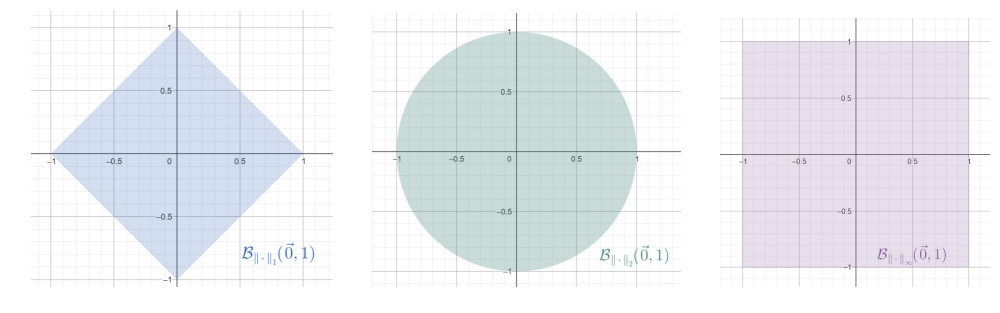

# Fonctions de deux variables 

## 1.Topologie de $\mathbb{R}^2$

一般来说, 拓扑是指一组被称为开集的子集集合        
在此, 拓扑来源于 **赋范向量空间** (espace vectoriel normé) 的结构, 即具有范数 (norme)          

### 1.1 Normé sur $\mathbb{R}^2$

-   **Définition: Norme** 

    ---

    范数是一个函数 $N$ , 将向量空间中的每个向量映射到一个非负实数: $N: \mathbb{R}^2 \to \mathbb{R}_{+}$
    
    * 非负性: $\forall \vec{x} \in \mathbb{R}^2, (N(\vec{x}) = 0 \to \vec{x} = \vec{0})$
    * 齐次性: $\forall (\lambda, \vec{x}) \in \mathbb{R} \times \mathbb{R}^2, N(\lambda \vec{x}) = |\lambda| N(\vec{x})$
    * 满足三角不等式: $\forall (\vec{x},\vec{y}) \in (\mathbb{R}^2)^2, N(\vec{x}+\vec{y}) \leq N(\vec{x}) + N(\vec{y})$

??? note "Extra-note"
    我们不需要强调函数值为非负实数, 因为可以用定义中的三个点推出: 

    \[
        \begin{cases}
        N(\vec{0}) = N{\vec{x}-\vec{x}} \leq N(\vec{x}) + N(\vec{-x}) = N(\vec{x}) + |-1| N(\vec{x}) = 2N(\vec{x}) \\
        N(\vec{0}) = N(0 \cdot \vec{0}) = 0 \cdot N(\vec{0}) = 0
        \end{cases}
    \]

    如果 $\mathbb{R}^2$ 具有一个范数 $N$ , 我们可以使用向量空间的结构来定义一个距离: 

    \[
        d_N: 
        \begin{cases}
        \mathbb{R}^2 \times \mathbb{R}^2 \to \mathbb{R}_{+} \\
        (\vec{x},\vec{y}) \mapsto N(\vec{x}-\vec{y})
        \end{cases}
    \]

    这个函数具有与范数定义中的正定性和三角不等式相似的性质: 

    * &\forall (\vec{x},\vec{y}) \in \mathbb{R}^2 \times \mathbb{R}^2, (d_N(\vec{x},\vec{y}) = 0 \Rightarrow \vec{x} = \vec{y})&
    * $forall \vec{x}, \vec{y}, \vec{z} \in \mathbb{R}^2, d_N(\vec{x},\vec{z}) \leq d_N(\vec{x},\vec{y}) + d_N(\vec{y},\vec{z})$

    但需要注意的是, 距离的函数没有与齐次性对应的等价条件, 所以此函数不一定来源于范数            
    距离是一种更一般的概念, 不需要向量空间的结构                 

范数一般记为: 

\[
    ||\cdot|| : 
    \begin{cases}
    \mathbb{R}^2 \to \mathbb{R} \\
    \vec{x} \mapsto ||\vec{x}||
    \end{cases}
\]

!!! note "Proposition"            

    === "Contenu"                    
        设 $N$ , 是 $\mathbb{R}^2$ 上的一个范数, 则其满足逆三角不等式: 

        \[
            \forall (\vec{x},\vec{y}) \in \mathbb{R}^2 \times \mathbb{R}^2, |N(\vec{x})-N(\vec{y})| \leq N(\vec{x} - \vec{y})
        \]     
             
    === "Démonstration"                      
        设 $(\vec{x},\vec{y}) \in \mathbb{R}^2 \times \mathbb{R}^2$, 有: 
        
        \[
            \begin{cases}
            N(\vec{x}) = N((\vec{x}-\vec{y})+\vec{y}) \leq N(\vec{x}-\vec{y}) + N(\vec{y}) \\
            N(\vec{y}) = N((\vec{y}-\vec{x})+\vec{x}) \leq N(\vec{y}-\vec{x}) + N(\vec{x})
            \end{cases}
            \Rightarrow
            \begin{cases}
            N(\vec{x}) - N(\vec{y}) \leq N(\vec{x}-\vec{y}) \\
            N(\vec{y}) - N(\vec{x}) \leq N(\vec{y}-\vec{x}) = N(\vec{x}-\vec{y})
            \end{cases}
            \Rightarrow
            |N(\vec{x})-N(\vec{y})| \leq N(\vec{x} - \vec{y})
        \]
        
        命题得证

!!! example "Exemple"
    === "Probleme"
        对于任意 \( \vec{x} = (x_1, x_2) \in \mathbb{R}^2 \), 定义以下三种常见的范数:   

        \[
            \|\vec{x}\|_1 := |x_1| + |x_2|
        \]

        \[
            \|\vec{x}\|_2 := \sqrt{x_1^2 + x_2^2}
        \]

        \[
            \|\vec{x}\|_\infty := \max\{|x_1|, |x_2|\}
        \]
        
        证明它们满足范数定义中的三个性质  

    === "Solution"
        设 \( \vec{x} = (x_1, x_2) \), \( \vec{y} = (y_1, y_2) \in \mathbb{R}^2, \lambda \in \mathbb{R} \)   

        非负性: 

           - \( \|\vec{x}\|_1 = 0 \iff |x_1| + |x_2| = 0 \iff x_1 = 0, x_2 = 0 \iff \vec{x} = (0,0) \) 
           - \( \|\vec{x}\|_2 = 0 \iff \sqrt{x_1^2 + x_2^2} = 0 \iff x_1^2 + x_2^2 = 0 \iff x_1 = 0, x_2 = 0 \iff \vec{x} = (0,0) \) 
           - \( \|\vec{x}\|_\infty = 0 \iff \max\{|x_1|, |x_2|\} = 0 \iff x_1 = 0, x_2 = 0 \iff \vec{x} = (0,0) \) 

        齐次性:

           - \( \|\lambda \vec{x}\|_1 = |\lambda x_1| + |\lambda x_2| = |\lambda| (|x_1| + |x_2|) = |\lambda| \|\vec{x}\|_1 \) 
           - \( \|\lambda \vec{x}\|_2 = \sqrt{\lambda^2 x_1^2 + \lambda^2 x_2^2} = |\lambda| \sqrt{x_1^2 + x_2^2} = |\lambda| \|\vec{x}\|_2 \) 
           - \( \|\lambda \vec{x}\|_\infty = \max\{|\lambda x_1|, |\lambda x_2|\} = |\lambda| \max\{|x_1|, |x_2|\} = |\lambda| \|\vec{x}\|_\infty \) 

        三角不等式:

           - \( \|\vec{x} + \vec{y}\|_1 = |x_1 + y_1| + |x_2 + y_2| \leq |x_1| + |y_1| + |x_2| + |y_2| = \|\vec{x}\|_1 + \|\vec{y}\|_1 \) 
           - \( \|\vec{x} + \vec{y}\|_\infty = \max\{|x_1 + y_1|, |x_2 + y_2|\} \leq \max\{|x_1| + |y_1|, |x_2| + |y_2|\} \leq \max\{|x_1|, |x_2|\} + \max\{|y_1|, |y_2|\} = \|\vec{x}\|_\infty + \|\vec{y}\|_\infty \) 
           - 对于 \( \|\cdot\|_2 \) 范数, 使用柯西-施瓦茨不等式: 

            \[
                (x_1 y_2 - x_2 y_1)^2 \geq 0 \Rightarrow 2x_1 y_1 + 2x_2 y_2 \leq x_1^2 + x_2^2 + y_1^2 + y_2^2
            \]

            由此得到: 

            \[
                \|\vec{x} + \vec{y}\|_2 = \sqrt{(x_1 + y_1)^2 + (x_2 + y_2)^2} \leq \sqrt{x_1^2 + x_2^2} + \sqrt{y_1^2 + y_2^2} = \|\vec{x}\|_2 + \|\vec{y}\|_2
            \]

        ---

        \( \|\cdot\|_2 \) 也被称为欧几里得范数, 因为它来源于如下内积: 

        \[
            \cdot :
            \begin{cases}
            \mathbb{R}^2 \times \mathbb{R}^2 \to \mathbb{R} \\
            (\vec{x}, \vec{y}) \mapsto x_1 y_1 + x_2 y_2
            \end{cases}
        \]

        柯西-施瓦茨不等式可写为: 

        \[
            \forall \vec{x},\vec{y} \in \mathbb{R}, |\vec{x} \cdot \vec{y}| \leq \|\vec{x}\|_2 \|\vec{y}\|_2
        \]

        利用内积, 可以重写三角不等式的证明: 

        \[
            \|\vec{x} + \vec{y}\|_2 = \sqrt{(\vec{x} + \vec{y}) \cdot (\vec{x} + \vec{y})} = \sqrt{\|\vec{x}\|_2^2 + 2 \vec{x} \cdot \vec{y} + \|\vec{y}\|_2^2}
        \]

        \[
            \leq \sqrt{\|\vec{x}\|_2^2 + 2 \|\vec{x}\|_2 \|\vec{y}\|_2 + \|\vec{y}\|_2^2} = \|\vec{x}\|_2 + \|\vec{y}\|_2
        \]

        ---

        与其他范数不同, 欧几里得范数满足平行四边形恒等式: 

        \[
            \forall \vec{x}, \vec{y} \in \mathbb{R}^2, \quad \|\vec{x} + \vec{y}\|_2^2 + \|\vec{x} - \vec{y}\|_2^2 = 2 (\|\vec{x}\|_2^2 + \|\vec{y}\|_2^2)
        \]

        但对于 \( \|\cdot\|_1 \) 和 \( \|\cdot\|_\infty \) , 存在某些 \( \vec{x}, \vec{y} \) 使得: 

        \[
            \|\vec{x} + \vec{y}\|_1^2 + \|\vec{x} - \vec{y}\|_1^2 \neq 2 (\|\vec{x}\|_1^2 + \|\vec{y}\|_1^2)
        \]

        \[
            \|\vec{x} + \vec{y}\|_\infty^2 + \|\vec{x} - \vec{y}\|_\infty^2 \neq 2 (\|\vec{x}\|_\infty^2 + \|\vec{y}\|_\infty^2)
        \]

        ---
        Fréchet-von Neumann-Jordan 定理表明, 如果一个范数 \( N \) 满足平行四边形恒等式, 则可以定义一个与其兼容的内积, 例如: 

        \[
            \forall \vec{x}, \vec{y} \in \mathbb{R}^2, \quad \langle \vec{x}, \vec{y} \rangle := \frac{N(\vec{x} + \vec{y})^2 - N(\vec{x} - \vec{y})^2}{4}
        \]

        这说明 \( \|\cdot\|_2 \) 范数源自一个内积, 而 \( \|\cdot\|_1 \) 和 \( \|\cdot\|_\infty \) 不是由内积导出的范数 

-   **Définition** 

    ---

    设 \( N \) 是 \(\mathbb{R}^2\) 上的一个范数, \(\vec{c} \in \mathbb{R}^2\), \( r \in \mathbb{R}^*_+ \)  

    - 开球 (boule ouverte): 以 \(\vec{c}\) 为中心, \( r \) 为半径的 **开球** (对于范数 \( N \)) 定义为:   

    \[
        \mathcal{B}_N (\vec{c}; r) := \{ \vec{x} \in \mathbb{R}^2 \mid N (\vec{x} - \vec{c}) < r \}
    \]  

    - 闭球 (boule fermée): 以 \(\vec{c}\) 为中心, \( r \) 为半径的 **闭球** (对于范数 \( N \)) 定义为:   

    \[
        \mathcal{B}_{f,N} (\vec{c}; r) := \{ \vec{x} \in \mathbb{R}^2 \mid N (\vec{x} - \vec{c}) \leq r \}
    \]  

    - 球面 (sphère): 以 \(\vec{c}\) 为中心, \( r \) 为半径的 **球面** (对于范数 \( N \)) 定义为:   

    \[
        \mathcal{S}_N (\vec{c}; r) := \{ \vec{x} \in \mathbb{R}^2 \mid N (\vec{x} - \vec{c}) = r \}
    \]

??? note "Extra-note"
    以 \(\vec{c}\) 为中心的球与以 \(\vec{0}\) 为中心的球通过平移相重叠:   

    \[
        \vec{c} + B_N (\vec{0}; r) = \{ \vec{c} + \vec{u} \mid N (\vec{u} - \vec{0}) < r \} = \{ \vec{v} \mid N (\vec{v} - \vec{c}) < r \} = B_N (\vec{c}; r)
    \]

    下图为三种常见范数对应的单位球, 即以 \(\vec{0}\) (为中心, 半径为 1 的开球)

       

    需要注意的是: 如果我们知道与某个范数 \( N \) 相关的球面 \( S \) , 那么该范数就可以被完全确定                 

    对于所有非零向量 \(\vec{x} \in \mathbb{R}^2 \setminus \{ \vec{0} \}\), 由于 \( N(\vec{x}) > 0 \), 所以存在唯一的 \( \lambda \in \mathbb{R}_+^* \) 使得: $\lambda N(\vec{x}) = 1$

    由于 \( N(\lambda \vec{x}) = |\lambda| N(\vec{x}) = \lambda N(\vec{x}) = 1 \),   
    可知 \( \lambda \vec{x} \in S \) , 恰好落在球面 \( S \) 上   

    无论选择何种范数 \( N \), 单位球 \( B \) 都满足以下性质:   

    \[
        \forall \vec{x}, \vec{y} \in B, \quad \forall \lambda \in [0,1], \quad N((1 - \lambda) \vec{x} + \lambda \vec{y}) \leq (1 - \lambda) N(\vec{x}) + \lambda N(\vec{y}) \leq (1 - \lambda) + \lambda = 1
    \]

    这意味着, 对于任意 \(\lambda \in [0,1]\), 点 \((1 - \lambda) \vec{x} + \lambda \vec{y}\) 位于 \( B \) 上   
    换句话说, 单位球是凸集

    我们同样可以证明其逆命题也成立:   
    如果 \( C \) 是 \(\mathbb{R}^2\) 的一个子集, 且满足以下条件 \( C \) 包含原点 \( \vec{0} \) 且 \( C \) 是凸集                     
    那么, 必定存在一个范数 \( N_C \), 使得单位球满足 $B_{N_C} (\vec{0}; 1) \subseteq C \subseteq B_{f, N_C} (\vec{0}; 1)$

-   **Définition** 

    ---

    设 \( N_1 \) 和 \( N_2 \) 是 \(\mathbb{R}^2\) 上的两个范数             
    我们称 \( N_1 \) 受控 (dominée) 于 \( N_2 \), 或者说 \( N_2 \) 比 \( N_1 \) 更精细 (plus fine), 记作: $N_1 = O(N_2)$               
    如果存在一个常数 \( K \in \mathbb{R}_+^* \) , 使得:   

    \[
        \forall \vec{x} \in \mathbb{R}^2, N_1(\vec{x}) \leq K N_2(\vec{x})
    \]

    如果 \( N_1 = O(N_2) \) 且 \( N_2 = O(N_1) \), 则称 \( N_1 \) 和 \( N_2 \) 是具有等价关系 ("$\sim$") 的范数 

??? note "Extra-note"
    以上定义表明, 如果 \( \vec{x} \in B_{N_2} (\vec{0}, 1) \), 那么 \( \vec{x} \in B_{N_1} (\vec{0}, K) \), 即 \( B_{N_2} (\vec{0}, 1) \subseteq B_{N_1} (\vec{0}, K) \)  
    更一般地说,

    \[ 
        \forall \vec{x} \in \mathbb{R}^2, \forall r > 0, \exists \rho > 0, \quad B_{N_2} (\vec{x}, \rho) \subseteq B_{N_1} (\vec{x}, r) 
    \]  

    只需取 \( \rho := \frac{r}{K} > 0 \) 即可证明                

!!! note "Proposition"            

    === "Contenu"                    

        $\mathbb{R}^2$ 上的三种常见范数是等价的 ([例](#1)中的三个函数)   
        即: 

        \[
            \|\vec{x}\|_1 \sim \|\vec{x}\|_2 \sim \|\vec{x}\|_\infty
        \]            
              
    === "Démonstration"                          

        对于任意 \(\vec{x} \in \mathbb{R}^2\), 设 \(\vec{x} = (x_1, x_2)\), 我们有以下关系:   

        \[
            \begin{cases}
            \|\vec{x}\|_{\infty} = \max \{|x_1|, |x_2|\} \leq |x_1| + |x_2| = \|\vec{x}\|_1 \leq 2 \max \{|x_1|, |x_2|\} = 2 \|\vec{x}\|_{\infty} \\  
            \|\vec{x}\|_{\infty} = \max \{|x_1|, |x_2|\} \leq \sqrt{x_1^2 + x_2^2} = \|\vec{x}\|_2 \leq \sqrt{2 \max \{|x_1|^2, |x_2|^2\}} = \sqrt{2} \|\vec{x}\|_{\infty}
            \end{cases}
        \]

        这说明 \(\|\cdot\|_{\infty} \sim \|\cdot\|_1\) 且 $\|\cdot\|_{\infty} \sim \|\cdot\|_2$ , 因此三种范数是等价    
        命题得证

        ---

        我们还可以用单个不等式链来证明:   

        \[
            \forall \vec{x} = (x_1, x_2) \in \mathbb{R}^2, \quad \frac{1}{\sqrt{2}} \|\vec{x}\|_1 \leq \|\vec{x}\|_{\infty} \leq \|\vec{x}\|_2 \leq \|\vec{x}\|_1
        \]

        对于所有 \( r > 0 \), 这些范数的单位球满足以下包含关系:   

        \[
            B_{\|\cdot\|_1} (\vec{0}, r) \subseteq B_{\|\cdot\|_2} (\vec{0}, r) \subseteq B_{\|\cdot\|_{\infty}} (\vec{0}, r) \subseteq B_{\|\cdot\|_1} (\vec{0}, 2r)
        \]

           

-   **Définition** 

    ---

    集合 \( X \) 是 \( \mathbb{R}^2 \) 的一个有界子集, 当且仅当:   

    \[
        \exists M \in \mathbb{R}^+, \forall \vec{x} \in X, \|\vec{x}\|_2 \leq M
    \]

    \( X \) 是有界的, 当且仅当:   
    
    \[
        \forall r > 0, \exists \lambda > 0, X \subseteq \lambda B_{\|\cdot\|_2}(\vec{0}, r) = \{ \lambda \vec{x} \mid \vec{x} \in B_{\|\cdot\|_2}(\vec{0}, r) \} = B_{\|\cdot\|_2}(\vec{0}, \lambda r)
    \]

    

    集合 \( \Omega \) 是 \( \mathbb{R}^2 \) 的开集, 当且仅当:   

    \[
        \forall \vec{x} \in \Omega, \exists r \in \mathbb{R}_+^*, B_{\|\cdot\|_2}(\vec{x}, r) \subseteq \Omega
    \]

??? note "Extra-note"
    通常我们会说 “设 \( \Omega \) 为 \( \mathbb{R}^2 \) 的一个开集”, 其中隐含的意思是“\( \Omega \) 是一个开子集”, 在法语中用阳性形式表达  
    根据[命题](#2), 若使用一个与 \( \|\cdot\|_2 \) 等价的范数来定义上述概念, 所得的定义仍然是一致的

!!! example "Exemple"
    设 \( a, b, c, d \in \mathbb{R} \) 且 \( a < b \) 且 \( c < d \), 那么开区间 \( ]a, b[ \times ]c, d[ \) 是 \( \mathbb{R}^2 \) 的一个开集   

    ---

    对于任意 \( \vec{x} = (x_1, x_2) \in ]a, b[ \times ]c, d[ \), 有 \( a < x_1 < b \) 且 \( c < x_2 < d \)   
    因此, 我们定义:   

    \[
        \rho := \min (b - x_1, x_1 - a, d - x_2, x_2 - c) > 0
    \]

    由此可知,   

    \[
        B_{\|\cdot\|_\infty}(\vec{x}, \rho) \subseteq ]a, b[ \times ]c, d[
    \]

    此外, 由于在 \( \mathbb{R}^2 \) 中, 范数 \( \|\cdot\|_2 \) 的单位球包含于范数 \( \|\cdot\|_\infty \) 的单位球, 即:   

    \[
        B_{\|\cdot\|_2}(\vec{x}, \rho) \subset B_{\|\cdot\|_\infty}(\vec{x}, \rho),
    \]

    所以可以推出 \( B_{\|\cdot\|_2}(\vec{x}, \rho) \subseteq ]a, b[ \times ]c, d[ \)   
    因此, \( ]a, b[ \times ]c, d[ \) 是开集 

!!! note "Proposition"            
    === "Contenu"                    
        所有开球都是开集
    === "Démonstration"                          
        设 \( N \) 是一个范数, \( B_N(\vec{c}, r) \) 是以 \( \vec{c} \) 为中心, 半径为 \( r > 0 \) 的开球                
        设 \( \vec{x} \in B_N(\vec{c}, r) \), 我们需要证明存在一个半径 \( \rho > 0 \) 使得: $B_N(\vec{x}, \rho) \subseteq B_N(\vec{c}, r)$

        由于 \( \vec{x} \in B_N(\vec{c}, r) \), 所以 $N(\vec{x} - \vec{c}) < r$  

        令 $\rho := r - N(\vec{x} - \vec{c}) > 0$   

        \(\forall \vec{y} \in B_N(\vec{x}, \rho) \), 有三角不等式:   

        \[
            N(\vec{y} - \vec{c}) \leq N(\vec{y} - \vec{x}) + N(\vec{x} - \vec{c}) < \rho + N(\vec{x} - \vec{c}) = r
        \]  

        因此, \( \vec{y} \in B_N(\vec{c}, r) \), 且对于所有 \( \vec{y} \in B_N(\vec{x}, \rho) \) 都成立   
        命题得证
          

-   **Définition** 

    ---

    设 \((\vec{u}_n)_{n\in\mathbb{N}}\) 是一个取值于 \(\mathbb{R}^2\) 的序列       

    * 序列是收敛, 当且仅当, 如果存在 \(\vec{l} \in \mathbb{R}^2\), 使得 $\lim_{n\to\infty} \vec{u}_n = \vec{l}$
    即: 

    \[
        \forall \varepsilon > 0, \exists N \in \mathbb{N}, \forall n \in N, (n \geq N \Rightarrow \|\vec{u}_n - \vec{l}\|_2 < \varepsilon)
    \]

    或者等价地, 存在 \(\vec{l} \in \mathbb{R}^2\), 使得: 

    \[
        \forall \varepsilon > 0, \exists N \in \mathbb{N}, \forall n \in N, n \geq N, \vec{u}_n \in B_{\|\cdot\|_2}(\vec{l}, \varepsilon)
    \]

    * 如果序列 \(\{\vec{u}_n\}\) 不满足上述收敛条件, 则称其发散 

??? note "Extra-note"
    我们通常会表述为: “从某一项开始, 序列的所有项都落在开球 \(B_{\|\cdot\|_2}(\vec{l}, \varepsilon)\) 内” 

!!! note "Proposition"            
    === "Contenu"         
        设 \((\vec{u}_n)_{n\in\mathbb{N}}\) 是 \(\mathbb{R}^2\) 中的一个序列         
        
        * 极限的唯一性: 如果 \(\{\vec{u}_n\}\) 收敛到 \(\vec{l}\) 和 \(\vec{m}\), 则 \(\vec{l} = \vec{m}\)                        
        * 坐标分量的收敛性: 对所有 \(n \in \mathbb{N}\), 如果 \(\vec{u}_n = (x_n, y_n)\) 且 \(\vec{l} = (l_x, l_y)\), 则  

        \[
            \lim_{n\to\infty} \vec{u}_n = \vec{l} \quad \Longleftrightarrow \quad
            \begin{cases}
            \lim_{n\to\infty} x_n = l_x \\
            \lim_{n\to\infty} y_n = l_y
            \end{cases}
        \]

    === "Démonstration"                          
        (i): 假设 \(\{\vec{u}_n\}\) 同时收敛到 \(\vec{l}\) 和 \(\vec{m}\), 但 \(\vec{l} \neq \vec{m}\), 则: 

        \[
            \begin{cases}
            \forall \varepsilon_1 > 0, \exists N_1 \in \mathbb{N}, \forall n \geq N_1, \vec{u}_n \in B_{\|\cdot\|_2}(\vec{l}, \varepsilon_1) \\
            \forall \varepsilon_2 > 0, \exists N_2 \in \mathbb{N}, \forall n \geq N_2, \vec{u}_n \in B_{\|\cdot\|_2}(\vec{m}, \varepsilon_2)
            \end{cases}
        \]

        令 \(\varepsilon_1 = \varepsilon_2 = \frac{1}{2} \|\vec{l} - \vec{m}\|_2\), 则对于所有 \(n \geq \max\{N_1, N_2\}\),   

        \[
            \vec{u}_n \in B_{\|\cdot\|_2}(\vec{l}, \varepsilon_1) \cap B_{\|\cdot\|_2}(\vec{m}, \varepsilon_2)
        \]

        但由于 \(\|\vec{l} - \vec{m}\|_2 > \varepsilon_1 + \varepsilon_2\), 这与两球不相交矛盾 因此, \(\vec{l} = \vec{m}\)

        ---
        
        (ii): \(\lim_{n\to\infty} \vec{u}_n = \vec{l}\) 意味着: 

        \[
            \forall \varepsilon > 0, \exists N \in \mathbb{N}, \forall n \geq N, \vec{u}_n \in B_{\|\cdot\|_2}(\vec{l}, \varepsilon)
        \]

        由于 $B_{\|\cdot\|_2}(\vec{l}, \varepsilon) \subseteq B_{\|\cdot\|_\infty}(\vec{l}, \varepsilon)$ , 有 $\max\{|x_n - l_x|, |y_n - l_y|\} < \varepsilon$       
        这意味着: $\begin{cases} |x_n - l_x| < \varepsilon \\ |y_n - l_y| < \varepsilon \end{cases}$
        由此可得: 

        \[
        \lim_{n\to\infty} x_n = l_x, \quad \lim_{n\to\infty} y_n = l_y
        \]

        相反的, 如果: 

        \[
            \begin{cases}
            \forall \varepsilon_1 > 0, \exists N_1 \in \mathbb{N}, \forall n \geq N_1, |x_n - l_x| < \varepsilon_1 \\
            \forall \varepsilon_2 > 0, \exists N_2 \in \mathbb{N}, \forall n \geq N_2, |y_n - l_y| < \varepsilon_2
            \end{cases}
        \]

        令 \(\varepsilon_1 = \varepsilon_2 = \frac{\varepsilon}{\sqrt{2}}\), 则对于所有 \(n \geq \max \{N_1, N_2\}\), 有: 

        \[
        \|\vec{u}_n - \vec{l}\|_2 = \sqrt{(x_n - l_x)^2 + (y_n - l_y)^2} \leq \sqrt{\left(\frac{\varepsilon}{\sqrt{2}}\right)^2 + \left(\frac{\varepsilon}{\sqrt{2}}\right)^2} = \varepsilon
        \]

        因此, \(\vec{u}_n \in B_{\|\cdot\|_2}(\vec{l}, \varepsilon)\), 即 \(\{\vec{u}_n\}\) 收敛到 \(\vec{l}\) 

        以上两个命题均得证

-   **Définition** 

    ---

    设 \(X \subseteq \mathcal{P}(\mathbb{R}^2)\), 对于 \(\vec{a} \in \mathbb{R}^2\) , 当且仅当其满足: 

    \[
        \forall \varepsilon > 0, \exists \vec{x} \in X, \|\vec{x} - \vec{a}\|_2 < \varepsilon
    \]

    或者等价地: 

    \[
        \forall \varepsilon > 0, B_{\|\cdot\|_2}(\vec{a}, \varepsilon) \cap X \neq \emptyset
    \]

    这时则称 \(\vec{a}\) 是 \(X\) 的聚点 (adhérent)    

    \(X\) 的闭包 (adhérence) 记作 \(\overline{X}\), 即所有 \(X\) 的聚点组成的集合 

!!! note "Proposition"            
    === "Contenu"         
        设 \(\vec{a} \in \mathbb{R}^2\), \(X\) 是 \(\mathbb{R}^2\) 的一个子集, 则: 

        \[
            \vec{a} \in \overline{X} \quad \Longleftrightarrow \quad \exists \{\vec{u}_n\}_{n\in\mathbb{N}} \subseteq X, \quad \lim_{n\to\infty} \vec{u}_n = \vec{a}
        \]

    === "Démonstration"                          
        
        (⇒) 充分性  
        根据聚点的定义, 取 \(\varepsilon_n = \frac{1}{n+1}\) , 有: 

        \[
            \forall n \in \mathbb{N}, \exists \vec{x}_n \in X, \quad \|\vec{x}_n - \vec{a}\|_2 < \varepsilon_n
        \]

        因此, \(\{\vec{x}_n\}_{n\in\mathbb{N}}\) 是 \(X\) 中的一个序列, 并且收敛到 \(\vec{a}\) 

        (⇐) 必要性  
        假设有: 

        \[
            \forall \varepsilon > 0, \exists N \in \mathbb{N}, \forall n \geq N, \|\vec{u}_n - \vec{a}\|_2 < \varepsilon
        \]

        可得: 

        \[
            B_{\|\cdot\|_2}(\vec{a}, \varepsilon) \cap X \neq \emptyset
        \]

        因此, \(\vec{a}\) 是 \(X\) 的一个聚点, 即 \(\vec{a} \in \overline{X}\) 
        
        命题得证

??? note "Extra-note" 
    记 \(\tau\) 为[定义](#3)的开集的集合, 记 \(\text{Cvg} \subseteq (\mathbb{R}^2)^\mathbb{N}\) 为所有收敛序列的集合, 这两个定义是基于范数和球, 但我们也可以直接用它们 (拓扑 (开集) 和收敛性) 相互定义   

    \(\mathbb{R}^2\) 中一点 \(\vec{l}\) 的邻域是指包含一个开集 \(U\) 且 \(U\) 包含 \(\vec{l}\) 的任何集合 \(V\) 

    * 若已知拓扑 \(\tau\), 可定义收敛序列  
    设 \(\{\vec{u}_n\}_{n\in\mathbb{N}}\) 是一个序列, 我们说它收敛到 \(\vec{l} \in \mathbb{R}^2\) 当且仅当: 

    \[
        \forall \vec{l} \text{ 的邻域 } V , \exists N \in \mathbb{N}, \forall n \geq N, \vec{u}_n \in V
    \]

    * 若已知收敛性 \(\text{Cvg}\), 可定义拓扑 \(\tau\)  
    设 \(U \subseteq \mathbb{R}^2\), 我们说它是一个开集 (即 \(U \in \tau\)) 当且仅当: 

    \[
        \forall \text{ 收敛到 } \vec{l} \text{ 的序列 } \{\vec{u}_n\}_{n\in\mathbb{N}}, \quad \text{若 } \vec{l} \in U, \text{ 则 } \exists N \in \mathbb{N}, \forall n \geq N, \vec{u}_n \in U
    \]

    虽然这并不适用于所有拓扑空间, 但在度量空间 (即带有度量或范数的空间) 中, 可以基于先前的证明构造, 得出: 

    \[
        \tau \longleftrightarrow \text{Cvg}
    \]

    即开集 (拓扑) 和收敛性是互相确定的 

### 1.2 Fonctions de deux variables

我们可以将一个二元函数理解为一族单变量函数            
设 \(X, Y, Z\) 是三个集合, 对于任意函数  

\[
    f: 
    \begin{cases}
    X \times Y \to Z \\
    (x, y) \mapsto f(x, y)
    \end{cases}
\]

可以定义以下 "偏映射" (les applications partielles): 

\[
    \left( f_y: 
    \begin{cases}
    X \to Z \\
    x \mapsto f(x, y)
    \end{cases}
    \right)_{\forall y \in Y}
    \quad
    \left( f_x: 
    \begin{cases}
    Y \to Z \\
    y \mapsto f(x, y)
    \end{cases}
    \right)_{\forall x \in X}
\]

即: 

\[
    f_{2,1}: 
    \begin{cases}
    Y \to Z^X \\
    y \mapsto f_y
    \end{cases}
    \quad
    f_{1,2}: 
    \begin{cases}
    X \to Z^Y \\
    x \mapsto f_x
    \end{cases}
\]

已知其中之一即可重构原来的二元函数, 这可以通过以下的图形等式表示: 

\[
    \Gamma_f := \{(x, y, f(x, y)) \mid (x, y) \in X \times Y\}
\]

\[
    = \bigcup_{y \in Y} \{(x, y, f(x, y)) \mid x \in X\}
\]

\[
    = \bigcup_{x \in X} \{(x, y, f(x, y)) \mid y \in Y\}
\]

\(\Gamma_f\) 可以按固定的 \(y\) 或 \(x\) 进行分割, 如果知道所有这些“切片”, 就可以重建整个函数 

一个特殊的二元函数情形是当 \(Z = \mathbb{R}\)（或某个代数）时, 考虑满足以下条件的函数 \( f \in \mathbb{R}^{X \times Y} \): 

\[
\forall (y_1, y_2) \in Y^2, \exists (\lambda, \mu) \in \mathbb{R}^2 \setminus \{(0, 0)\}, \quad \lambda f_{y_1} + \mu f_{y_2} = 0
\]

或等价地: 

\[
\forall (x_1, x_2) \in X^2, \exists (\lambda, \mu) \in \mathbb{R}^2 \setminus \{(0, 0)\}, \quad \lambda f_{x_1} + \mu f_{x_2} = 0.
\]

分析第一种情况: 如果 \( f = 0 \), 则条件自动成立, 不施加任何约束 假设存在某个 \((x_0, y_0) \in X \times Y\) 使得 \( f(x_0, y_0) \neq 0 \), 则

\[
\forall y \in Y, \exists (\lambda_y, \mu_y) \neq (0, 0), \forall x \in X, \quad \lambda_y f_{y_0}(x) + \mu_y f_y(x) = 0
\]

由此可得

\[
Y_1 := \{ y \in Y \mid \lambda_y \neq 0 \} \neq \emptyset
\]

否则会推出 \( f = 0 \) 对于 \( y \in Y_1 \), 有

\[
\mu_{y_1} f_{y_1}(x_0) = -\lambda_{y_1} f(x_0, y_0) \neq 0
\]

因此 \( \mu_{y_1} \neq 0 \), 从而

\[
\forall y \in Y_1, \forall x \in X, \quad f(x, y) = -\frac{\lambda_y}{\mu_y} f(x, y_0)
\]

对于 \( y \in Y \setminus Y_1 \), \(\lambda_y = 0\), 但由于 \((\lambda_y, \mu_y) \neq (0,0)\), 必须有 \(\mu_y \neq 0\) 此时, 方程 \( \lambda_y f_{y_0} + \mu_y f_y = 0 \) 直接推出 \( f_y = 0 \) 

综上所述, 存在一个函数 \( g: Y \to Z \) 使得

\[
\forall (x, y) \in X \times Y, \quad f(x, y) = g(y) \cdot f_{y_0}(x)
\]

这样的函数被称为**可分变量函数**（separable functions） 

然而, 二元函数的定义域不一定是笛卡尔积集合 函数 \( f \) 的定义域 \( D \subseteq \mathbb{R}^2 \) 可能具有如下形式: 

\[
D_1(x_0, y_0) := \{x \in \mathbb{R} \mid (x, y_0) \in D\}
\]

\[
D_2(x_0, y_0) := \{y \in \mathbb{R} \mid (x_0, y) \in D\}
\]

定义相应的部分应用: 

\[
f_{y_0}: D_1(x_0, y_0) \to \mathbb{R}, \quad x \mapsto f(x, y_0)
\]

\[
f_{x_0}: D_2(x_0, y_0) \to \mathbb{R}, \quad y \mapsto f(x_0, y)
\]

