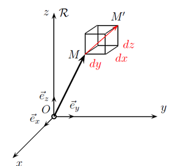
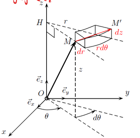
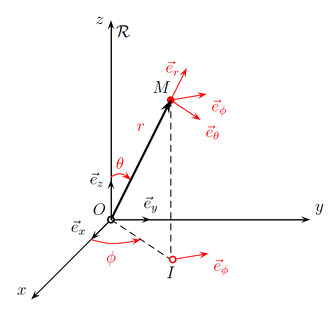
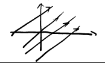
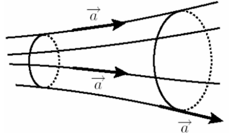

# Analyse vectorielle

## 1.Référentiel et systèmes de coordonnées

### 1.1 Référentiel (参考系)

一个系统如何运动是由观察者决定的, 这是一个相对的概念, 所以我们会选择一个自身不发生改变的物体作为 **参考系**                             
地表参考系(le référentiel terrestre), 地心参考系(le référentiel géocentrique), 日心参考系(le référentiel héliocentrique), 这些都是参考系的例子                    
对于满足惯性定律(物体做匀直运动时合外力为零)的参考系, 我们称其为 **惯性参考系** (référentiel galiléen ou référentiel inertiel)                       
为了描述物体在参考系中的运动, 我们会选择一个坐标系, 坐标系在参考系中相对静止              

### 1.2 Coordonnées cartésiennes (笛卡尔坐标系)

<!-- 

 -->

点 $M$ 在 $t$ 时刻, 坐标系中的坐标为 $(x,y,z)$             
$(\vec{e_x},\vec{e_y},\vec{e_z})$ 是该坐标系的基底, 有如下性质:                         

* 三个向量两两正交
* $||\vec{e_x}|| = ||\vec{e_y}|| = ||\vec{e_z}|| = 1$                      
* $\vec{e_z} = \vec{e_x} \wedge \vec{e_z}$            

那么:             

* 点 $M$ 的位置可以表示为 $\vec{OM} = x\vec{e_x} + y\vec{e_y} + z\vec{e_z}$              
* 点 $M$ 的微小位移可以表示为 $\vec{dOM} = dx\vec{e_x} + dy\vec{e_y} + dz\vec{e_z}$                       
* 点 $M$ 的速度可以表示为 $\vec{v} = \frac{\vec{dOM}}{dt} = \frac{dx}{dt}\vec{e_x} + \frac{dy}{dt}\vec{e_y} + \frac{dz}{dt}\vec{e_z} = \dot{x}\vec{e_x} + \dot{y}\vec{e_y} + \dot{z}\vec{e_z}$            

### 1.3 Coordonnées cylindriques (圆柱坐标系)

<!--

 -->

点 $M$ 在坐标系中的坐标为 $(r,\theta,z)$, 其中, $r$ 是 $OM$ 投影在 $Oxy$ 上的 $HM$ 的长度, 角 $\theta$ 是 $x$ 轴与 $HM$ 的夹角, $z$ 是高度                                    
$(\vec{e_r},\vec{e_\theta},\vec{e_z})$ 是该坐标系的基底, 有如下性质 :                                          

* $\vec{e_r} = \frac{\vec{HM}}{||\vec{HM}||} = \frac{\vec{HM}}{r}$           
* $\vec{e_\theta}$ 与 $\vec{e_r}, \vec{e_z}$ 分别正交                  
* 将 $\vec{e_r}$ 和 $\vec{e_\theta}$ 根据笛卡尔坐标系分解:   
        
\[
    \vec{e_r} = cos(\theta) \vec{e_x} + sin(\theta) \vec{e_y}
\]

\[
    \vec{e_\theta} = - sin(\theta) \vec{e_x} + cos(\theta) \vec{e_y}
\]

进而得出: $d \vec{e_r} = d \theta \vec{e_\theta}$ (因为 $\vec{e_r}$ 会随 $M$ 位置改变而改变, 所以 $d\vec{e_r}$ 不为零, 而对于基底中的 $z$ 方向的分量, 因为 $\vec{e_z}$ 不会发生改变, 所以有 $d\vec{e_z} = 0$)

那么:                       

* 点 $M$ 的微小位移可以表示为 $\vec{dOM} = d(r\vec{e_r} + z\vec{e_z}) = dr\vec{e_r} + rd\vec{e_r} + dz\vec{e_z} = dr\vec{e_r} + rd\theta \vec{e_\theta} + dz\vec{e_z}$              
* 点 $M$ 的速度可以表示为 $\vec{v} = \frac{d\vec{OM}}{td} = \frac{dr}{dt}\vec{e_r} + r \frac{d\theta}{dt} \vec{e_\theta} + \frac{dz}{dt}\vec{e_z} = \dot{r}\vec{e_r} + r \dot{\theta} \vec{e_\theta} + \dot{z}\vec{e_z}$          

### 1.4 Coordonnées sphériques (球坐标系)      

<!-- 

 -->

点 $M$ 在坐标系中的坐标为 $(r,\theta,\phi)$ , 其中, $r = OM$ , 角 $\theta$ 是 $\vec{e_z}$ 轴与 $\vec{OM}$ 的夹角 (在地表, 这个角度被称为余纬度, 而纬度等于 $\frac{\pi}{2} - \theta$), 角 $\phi$ 是 $\vec{e_x}$ 轴与 $\vec{OI}$ 的夹角, 点 $I$ 是点 $M$ 在平面 $Oxy$ 上的投影         
$(\vec{e_r},\vec{e_\theta},\vec{e_\phi})$ 是该坐标系的基底, 有如下性质 :   

* $\vec{e_r} = \frac{\vec{OM}}{||\vec{OM}||} = \frac{\vec{OM}}{r}$     
* $\vec{e_\theta}$ 位于平面 $(\vec{e_r},\vec{e_z})$ 中, 与 $\vec{e_r}$ 垂直

那么:            

* 点 $M$ 的微小位移可以表示为 $\vec{dOM} = dr\vec{e_r} + rd\theta \vec{e_\theta} + rsin(\theta)d \phi\vec{e_\phi}$              
* 点 $M$ 的速度可以表示为 $\vec{v} = \frac{d\vec{OM}}{dt} = \frac{dr}{dt}\vec{e_r} + r \frac{d\theta}{dt} \vec{e_\theta} + rsin(\theta) \frac{d\phi}{dt} \vec{e_\phi} = \dot{r}\vec{e_r} + r \dot{\theta} \vec{e_\theta} + rsin(\theta)\dot{\phi} \vec{e_\phi}$

## 2.Notion de champ 

### 2.1 Champ scalaire et champ vectoriel (标量场和向量场)

场是关于位置 $M$ 和时间 $t$ 的函数, 可以是标量场 (champ scalaire) 或者矢量场 (champ vectoriel)              
压力场, 温度场 (标量场) , 重力场 (矢量场) , 这些都是场的例子                          
当场与位置 $M$ 无关时, 称其为均匀场 (champ 
uniforme); 当场与时间 $t$ 无关时, 称其为静态场、永久场或稳态场 (champ stationnaire, 
permanent ou statique )                       

### 2.2 Ligne de champ et tube de champ (场线和"场管")

向量场 $\vec{A}$ 的场线是每一点上都与场 $\vec{A}$ 相切并且方向与 $\vec{A}$ 一致的曲线               
为了得到场 $\vec{A}$ 的场线方程, 可以使用公式 $\vec{A} \wedge d\vec{OM} = \vec{0}$ , 其中 $\vec{dOM}$ 是沿着场线的微小位移              

* 在笛卡尔坐标系中 $\vec{dOM} = dx\vec{e_x} + dy\vec{e_y} + dz\vec{e_z}$   
* 在圆柱坐标系中 $\vec{dOM} = dr\vec{e_r} + rd\theta \vec{e_\theta} + dz\vec{e_z}$       
* 在球坐标系中 $\vec{dOM} = dr\vec{e_r} + rd\theta \vec{e_\theta} + rsin(\theta)d \phi\vec{e_\phi}$         

若场在某点 $M$ 处为零, 则该点 $M$ 的场线会缩减为点 $M$ 本身                   

!!! example "Exemple"
    === "Problème"               
        确定由矢量场 $\vec{A} = k_1\vec{e_x} + k_2\vec{e_y}$ (其中 $k_1, k_2 > 0$ 且为常数) 在笛卡尔坐标系下定义的场线方程。             
    === "Solution"

        \[
            \vec{A} \wedge \vec{dOM} = \vec{0}
        \]

        \[
            \vec{0} = (k_1\vec{e_x} + k_2\vec{e_y}) \wedge (dx\vec{e_x} + dy\vec{e_y} + dz\vec{e_z})
        \]

        \[
            = k_1 d_x \vec{e_x} \wedge \vec{e_x} + k_1 d_y \vec{e_x} \wedge \vec{e_y} + k_1 d_z \vec{e_x} \wedge \vec{e_z} + k_2 d_x \vec{e_y} \wedge \vec{e_x} + k_2 d_y \vec{e_y} \wedge \vec{e_y} + k_2 d_z \vec{e_y} \wedge \vec{e_z}
        \]

        \[
            = k_1 d_y \vec{e_z} - k_1 d_z \vec{e_y} - k_2 d_x \vec{e_z} + k_2 d_z \vec{e_x}
        \]

        $$
        \begin{cases}
            k_2 dz = 0 \\                  
            k_1 dz = 0 \\                    
            k_1 dy - k_2 dx = 0                      
        \end{cases}
        \Rightarrow 
        \begin{cases} 
            dz = 0 \\
            k_2 dy - k_2 dx = 0 
        \end{cases} 
        \Rightarrow 
        dy = \frac{k_2}{k_1} dx 
        \Rightarrow 
        y = \frac{k_2}{k_1} x + C
        $$

        <figure markdown="span">
        
        <figcaption>
        asd
        </figcaption>
        </figure>

        <!-- 

 -->

tube de champ

### 2.3 Circulation et flux (环量和通量)

* **环量** : 流体的速度沿着一条闭曲线的路径积分                  
若 $M$ 和 $M'$ 是两个无限接近的点, 则矢量场 $\vec{A}$ 沿着其路径微小分量 $\vec{dl} = \vec{MM'}$ 的环量为标量: $dC = \vec{A} \cdot \vec{dl}$                 
沿任意路径 $\Gamma$ 的 $\vec{A}$ 的环量 $C$ , 可以通过将路径分割成无数个微小路径 $\vec{dl}$ , 并对它们求和计算得出: $C = \int_\Gamma dC = \int_\Gamma \vec{A} \cdot \vec{dl}$         
* **通量** : 通过一个面或一个物质的量                
同样, 矢量场 $\vec{A}$ 穿过一个微小面 $\vec{dS} = dS\vec{n}$ (其中 $\vec{n}$ 是 $\vec{dS}$ 的单位法向量) 的通量 $\phi$ 可表示为: $d\phi = \vec{A} \cdot \vec{dS}$           
矢量场 $\vec{A}$ 穿过任意面 $\Sigma$ 的通量 $\phi$ , 可以通过将其分割为无数个微小面 $\vec{dS}$ 并求和来计算: $\phi = \int_\Sigma d\phi = \int_\Sigma \vec{A} \cdot \vec{dS}$                     
如果面 $\Sigma$ 围成了一个体, 则称其为封闭面, 当法向量 $\vec{n}$ 指向体积内部时, 称之为入通量；当法向量 $\vec{n}$ 指向体积外部时, 称之为出通量                  

## 3.Opérateurs d’analyse vectorielle

一个向量算子可以将一个场转换成另一个场, 如: 时间导数算子 $\frac{\partial}{\partial t}$ , 它将场 $U(M,t)$ 与场 $\frac{\partial U}{\partial t}$ 联系起来, 下面将学习四个重要的算子                                      

### 3.1 Le gradient (梯度)

标量场 $U$ 的梯度, 记作 $\vec{grad}(U)$ , 使得 $dU = \vec{grad}(U) \cdot d\vec{OM}$ , 其中 $d\vec{OM}$ 是微小位移                 
物理意义: 梯度是一个向量, 用于表示标量场如何随位置变化                    
如果在某一空间区域内 $\vec{grad}(U) = 0$ , 这意味着该区域内场 $U$ 是均匀的
点 $M$ 的梯度与通过 $M$ 的等势线 (即 $U$ 为常数的曲线) 正交
梯度的方向指向 $U$ 增大的方向            
梯度的量纲: $[||\vec{grad}(U)||] = [U] \cdot L^{-1}$                               

下面将给出梯度在不同坐标系中的表达式:                    

* 笛卡尔坐标系: $\vec{grad}(U) = \frac{\partial U}{\partial x} \vec{e_x} + \frac{\partial U}{\partial y} \vec{e_y} + \frac{\partial U}{\partial z} \vec{e_z}$
* 圆柱坐标系: $\vec{grad}(U) = \frac{\partial U}{\partial r} \vec{e_r} + \frac{1}{r} \frac{\partial U}{\partial \theta} \vec{e_\theta} + \frac{\partial U}{\partial z} \vec{e_z}$
* 圆坐标系: $\vec{grad}(U) = \frac{\partial U}{\partial r} \vec{e_r} + \frac{1}{r} \frac{\partial U}{\partial \theta} \vec{e_\theta} + \frac{1}{rsin\theta} \frac{\partial U}{\partial \phi} \vec{e_\phi}$

在笛卡尔坐标系中, 我们引入算子 $\vec{\nabla} = \frac{\partial}{\partial x} \vec{e_x} + \frac{\partial}{\partial y} \vec{e_y} + \frac{\partial}{\partial z} \vec{e_z}$           
从而, 我们可以简化等式: $\vec{grad}(U) = \vec{\nabla}(U) = \vec{\nabla} U$                      

!!! example "Exemple"  
    === "Problème"               
        计算 $\vec{grad}(V)$ , $V = \frac{mr^2}{e\tau^2} - \frac{k}{e}r^2sin\theta + \frac{mgz}{e}cos\theta$         
        $m, \tau, k, e, g$ 都是带有量纲的常数                     
    === "Solution"

        \[
            \vec{grad}(V) = \frac{\partial}{\partial r} (\frac{mr^2}{e\tau^2} - \frac{k}{e}r^2sin\theta + \frac{mgz}{e}cos\theta) \vec{e_r} + \frac{1}{r} \frac{\partial}{\partial \theta} (\frac{mr^2}{e\tau^2} - \frac{k}{e}r^2sin\theta + \frac{mgz}{e}cos\theta) \vec{e_\theta} + \frac{\partial}{\partial z} (\frac{mr^2}{e\tau^2} - \frac{k}{e}r^2sin\theta + \frac{mgz}{e}cos\theta) \vec{e_z}
        \]

        \[
            = (\frac{2mr}{e\tau^2}-\frac{2kr}{e}sin\theta)\vec{e_r} - \frac{1}{r}(\frac{k}{e}r^2cos\theta+\frac{mgz}{e}sin\theta)\vec{e_\theta} + \frac{mg}{e}cos\theta \vec{e_z}
        \]

### 3.2 Le rotationnel (旋度)

向量场 $A$ 的旋度, 记作 $\vec{rot}(\vec{A})$                 
物理意义: 表示向量场 $A$ 的"旋转"的程度          
旋度的量纲: $[||\vec{rot}(\vec{A})||] = [||\vec{A}||] \cdot L^{-1}$         
对于所有的向量场 $A$ , 存在如下等价关系:             

\[
    \vec{rot}(\vec{A}) = \vec{0} \iff \exists U, 使得 \vec{A} = \vec{grad}(U)
\]

??? note "Extra-note"
    在力学中, 保守力是指满足以下条件的力: $\vec{rot}(\vec{f}) = \vec{0}$         
    也就是说, 保守力的旋度为零
    而这样的力 $\vec{f}$ 来源于某个势能 $E_p$ , 满足以下关系: $\vec{f} = - \vec{grad}(E_p)$
    而功 (记作 $W_{AB}$ ) 指的是一个物质系统在力场中从点 $A$ 移动到点 $B$ 时所交换的能量             
    如果力是保守的, 这个功只取决于起点 $A$ 和终点 $B$ , 而与系统所经过的路径无关
    有如下推导:                            

    \[
        W_{AB} = \int_{A}^{B} \vec{f} \cdot \vec{OM} = \int_{A}^{B} - \vec{grad}(E_p) \cdot d\vec{OM}    
    \]

    又有势能 $E_p$ 的全微分式: $d(E_p) = \vec{grad}(E_p) \cdot d\vec{OM}$

    \[
        W_{AB} = - \int_{a}^{b} dE_p = -(E_p(B)-E_p(A)) = - \delta E_p
    \]

    由此也可见, $W_{AB}$ 与 $A$ 和 $B$ 之间的路径无关

旋度的计算: $\vec{rot}(\vec{A}) = \vec{\nabla} \wedge \vec{A} = \begin{pmatrix}\frac{\partial}{\partial x} \\ \frac{\partial}{\partial y} \\ \frac{\partial}{\partial z}\end{pmatrix} \wedge \begin{pmatrix}A_x \\ A_y \\ A_z\end{pmatrix}$                     

下面将给出旋度在不同坐标系中的表达式:                        

* 笛卡尔坐标系: $\vec{rot}(\vec{A}) = (\frac{\partial A_z}{\partial y} - \frac{\partial A_y}{\partial z}) \vec{e_x} + (\frac{\partial A_x}{\partial z} - \frac{\partial A_z}{\partial x})  \vec{e_y} + (\frac{\partial A_y}{\partial x} - \frac{\partial A_x}{\partial y})  \vec{e_z}$                     
* 圆柱坐标系: $\vec{rot}(\vec{A}) = \left( \frac{1}{r} \frac{\partial A_z}{\partial \theta} - \frac{\partial A_\theta}{\partial z} \right) \vec{e_r} + \left( \frac{\partial A_r}{\partial z} - \frac{\partial A_z}{\partial r} \right) \vec{e_\theta} + \frac{1}{r} \left( \frac{\partial (r A_\theta)}{\partial r} - \frac{\partial A_r}{\partial \theta} \right) \vec{e_z}$                          
* 圆坐标系: $\vec{rot}(\vec{A}) =\frac{1}{r \sin \theta}\left[\frac{\partial(A_\phi \sin \phi)}{\partial \theta} - \frac{\partial A_\theta}{\partial \phi}\right] \vec{e_r}+ \frac{1}{r}\left[\frac{1}{\sin \theta} \frac{\partial A_r}{\partial \phi} - \frac{\partial}{\partial r}(r A_\phi)\right] \vec{e_\theta}+ \frac{1}{r}\left[\frac{\partial (r A_\theta)}{\partial r} - \frac{\partial A_r}{\partial \theta}\right] \vec{e_\phi}$                    

!!! note "Théorème de Stokes"
    沿封闭且有向的曲线 $\Gamma$ 的向量场 $A$ 的环量等于 $\vec{rot}(\vec{A})$ 的在任意由 $\Gamma$ 圈出的曲面的通量, 曲面的方向取决于 $\Gamma$ 的方向 (依据右手螺旋法则)                           
    
    \[
        \oint_{\Gamma} \vec{A} \vec{dl} = \iint_{\Sigma} \vec{rot}(\vec{A}) \vec{dS}
    \]

### 3.3 La divergence (散度)

向量场 $\vec{A}$ 的散度, 记作 $div(\vec{A})$             
物理意义: 表示向量场 $\vec{A}$ 在某个点邻域内的通量"密度"                    
涡流场内的散度为零                                 
散度的量纲: $[div(\vec{A})] = [||\vec{A}||] \cdot L^{-1}$      
对于所有的向量场 $A$ , 存在如下等价关系:             

\[
    div(\vec{A}) = \vec{0} \iff \exists \vec{B}, 使得 \vec{A} = \vec{rot}(\vec{B})
\]

下面将给出散度在不同坐标系中的表达式:  

* 笛卡尔坐标系: $div(\vec{A}) = \frac{\partial A_x}{\partial x} + \frac{\partial A_y}{\partial y} + \frac{\partial A_z}{\partial z}$                     
* 圆柱坐标系: $div(\vec{A}) = \frac{1}{r} \frac{\partial (r A_r)}{\partial r} + \frac{1}{r} \frac{\partial A_\theta}{\partial \theta} + \frac{\partial A_z}{\partial z}$                          
* 圆坐标系: $div(\vec{A}) = \frac{1}{r^2} \frac{\partial (r^2 A_r)}{\partial r} + \frac{1}{r \sin\theta} \frac{\partial (\sin\theta A_\theta)}{\partial \theta} + \frac{1}{r \sin\theta} \frac{\partial A_\phi}{\partial \phi}$               

在笛卡尔坐标系中: $div(\vec{A}) = \vec{\nabla} \cdot \vec{A}$
**注意** : $\vec{\nabla} \cdot \vec{A} \neq \vec{\nabla} \vec{A}$              

$$
\begin{cases}
    \vec{\nabla} \cdot \vec{A} = div(\vec{A}) \to 标量 \\                   
    \vec{\nabla} \vec{A} = \vec{\nabla}(\vec{A}) \to 向量                     
\end{cases}
$$                             

!!! note "Théorème de Green-Ostrogradski"
    向量场 $\vec{A}$ 通过封闭曲面 $S$ 的通量 (曲面局部朝外的单位法向量为 $\vec{n}$ ) 等于该曲面所围成的体积内散度 $div(\vec{A})$ 的积分

    \[
        \oiint_S \vec{A} \cdot \vec{n} \, dS = \iiint_V div(\vec{A}) \, dV
    \]

    $\oiint_S$ 表示积分曲面封闭   

### 3.4 Le laplacien (拉普拉斯算子)

标量场 $\vec{U}$ 的拉普拉斯算子, 记作 $\Delta U = div(\vec{grad}(U))$             
在数学上, 拉普拉斯算子表示某一点 $M$ 处的函数值 $U$ 与其在 $M$ 周围的平均值之间的差异, 可以看成是一个场在空间中的弯曲程度, 一些波动传播方程会涉及拉普拉斯算子                             
拉普拉斯算子的量纲: $[\Delta U] = [U] \cdot L^{-2}$      

下面将给出拉普拉斯算子在不同坐标系中的表达式:  

* 笛卡尔坐标系: $\Delta U = \frac{\partial^2 U}{\partial x^2} + \frac{\partial^2 U}{\partial y^2} + \frac{\partial^2 U}{\partial z^2}$                     
* 圆柱坐标系: $\Delta U = \frac{1}{r} \frac{\partial}{\partial r} \left( r \frac{\partial U}{\partial r} \right) + \frac{1}{r^2} \frac{\partial^2 U}{\partial \theta^2} + \frac{\partial^2 U}{\partial z^2}$                          
* 圆坐标系: $\Delta U = \frac{1}{r^2} \frac{\partial}{\partial r} \left( r^2 \frac{\partial U}{\partial r} \right) + \frac{1}{r^2 \sin\theta} \frac{\partial}{\partial \theta} \left( \sin\theta \frac{\partial U}{\partial \theta} \right) + \frac{1}{r^2 \sin^2\theta} \frac{\partial^2 U}{\partial \phi^2}$    

最后, 我们引入向量拉普拉斯算子 $\vec{\Delta}$ , 定义如下: 

\[
\vec{\Delta} \vec{A} = \vec{grad} (div (\vec{A})) - \vec{rot}(\vec{rot}(\vec{A}))
\]

在笛卡尔坐标系中, 拉普拉斯算子对向量场的表达式: $\vec{\Delta} \vec{A} = \frac{\partial^2 \vec{A}}{\partial x^2} + \frac{\partial^2 \vec{A}}{\partial y^2} + \frac{\partial^2 \vec{A}}{\partial z^2}$           

!!! example "Exemple"  
    === "Problème"               
        考虑一个复向量场, 其形式为: $\vec{A} = \vec{C} e^{j(\omega t - kx)}$
        其中: $\vec{C} = \vec{cste}$ (常向量), $\vec{k} = k \vec{e}_x$ , $j^2 = -1$
        要求证明, 在笛卡尔坐标系下: 

        \[
            div(\vec{A}) = -j \vec{k} \cdot \vec{A}
        \]

        \[
            \vec{rot}(\vec{A}) = -j \vec{k} \wedge \vec{A}
        \]

        \[
            \vec{\Delta} \vec{A} = -k^2 \vec{A}
        \]
                    
    === "Solution"
        * **对于第一个等式**: 

        \[
            div(\vec{A}) = \vec{\nabla} \cdot \vec{A} = \begin{pmatrix} \frac{\partial}{\partial x} \\ \frac{\partial}{\partial y} \\ \frac{\partial}{\partial z} \end{pmatrix} \wedge \begin{pmatrix} A_x \\ A_y \\ A_z \end{pmatrix}
        \]

        \[
            = \frac{\partial A_x}{\partial x} + \frac{\partial A_y}{\partial y} + \frac{\partial A_z}{\partial z}
        \]

        分别计算偏导数: 

        \[
            \frac{\partial A_x}{\partial x} = -C_x j k e^{j(\omega t - kx)} , \frac{\partial A_y}{\partial y} = 0 , \frac{\partial A_z}{\partial z} = 0
        \]

        代入: 

        \[
            div(\vec{A}) = -C_x j k e^{j(\omega t - kx)} = - j k A_x
        \]

        等式另一边: 

        \[
            - j \vec{k} \cdot \vec{A} = - j k \vec{e}_x \cdot (A_x \vec{e}_x + A_y \vec{e}_y + A_z \vec{e}_z) = - j k A_x
        \]

        因此: 

        \[
            div(\vec{A}) = - j \vec{k} \cdot \vec{A}
        \]

        * **对于第二个等式**: 
        因为有 $A_y = A_z = 0$ , 代入 $\vec{rot}(\vec{A})$ 的表达式后可以得到 $\vec{rot}(\vec{A}) = \vec{0}$ 
        同样的, 对于等式另一边, 也有 $- j \vec{k} \wedge \vec{A} = - j k \vec{e_x} \wedge (A_x e_x + A_y e_y + A_z e_z) = \vec{0}$

        * **对于第三个等式**:                        
        
        \[
            \vec{\Delta} \vec{A} = \frac{\partial^2 \vec{A}}{\partial x^2} + \frac{\partial^2 \vec{A}}{\partial y^2} + \frac{\partial^2 \vec{A}}{\partial z^2}
        \]        

        \[
            \frac{\partial^2 A_x}{\partial^2 x} = - C_x k^2 e^{j(\omega t - kx)} , \frac{\partial^2 A_y}{\partial^2 y} = 0 , \frac{\partial^2 A_z}{\partial^2 z} = 0
        \]

        \[
            \vec{\Delta} \vec{A} = - C_x k^2 e^{j(\omega t - kx)}
        \]

        与第一个等式比较后易知等式成立

        **关系的推广**

        这三个关系的符号显然会改变，如果场的形式为：

        \[
            \vec{A} = \vec{C} e^{j(kx - \omega t)}
        \]

        对于更一般形式的场，这些关系仍然成立：

        \[
            \vec{A} = \vec{C} e^{j(\omega t - \vec{k} \cdot \overrightarrow{OM})}
        \]

        其中：

        \[
            \overrightarrow{OM} = x \vec{e}_x + y \vec{e}_y + z \vec{e}_z
        \]

        \[
            \vec{k} = k_x \vec{e}_x + k_y \vec{e}_y + k_z \vec{e}_z
        \]

        这些场在电磁学的课程中将会着重研究
