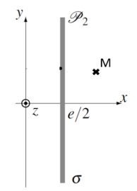

# Electrostatique

在本章中, 我们关注的是静电学, 即在研究参考系中静止分布的电荷及其所产生的效应

## 1.Champ électrostatique (静电场)

### 1.1 Force de Lorentz (洛伦兹力)  

在惯性参考系 $R$ 中, 一个电荷为 $q$ 的带电粒子, 在时刻 $t$ 处于点 $M$ , 并以速度 $\vec{v}(t)$ 运动, 它会与宇宙中其他带电粒子相互作用            
这种相互作用由 **洛伦兹力** (记作 $\vec{F_L}(M,t)$ ) 来描述, 该力作用于粒子, 并满足以下关系式: 

\[
    \vec{F_L} = q (\vec{E}(M,t) + \vec{v} \wedge \vec{B}(M,t))
\]

其中, $\vec{E}$ 叫做 **"champ électrique" 电场** ; $\vec{B}$ 叫做 **"champ magnétique" 磁场**                                    
它们在给定的参考系中与速度 $v$ 无关, 却于所选择的参考系 $R$ 有关                

我们为了研究粒子所受到的力, 作出以下假设:   

- 选取一个惯性参考系 \( R \)  
- 研究一个质量为 \( m \) 和电荷量为 \( q \) 恒定的粒子 \( M \)  
  - 对于电子, \( m \approx 10^{-30} \) kg, \( q = -e \approx -1.6 \times 10^{-19} \) C  
- 电场 $\vec{E}$ 足够弱, 使得粒子不具有相对论效应 (即 \( v \ll c \))                 

粒子 \( M \) 在电磁场 $(\vec{E},\vec{B})$ 中受到的洛伦兹力:  

\[
    \vec{F_L} = \vec{F_e} + \vec{F_m} = q\vec{E} + q\vec{v} \wedge \vec{B}
\]

!!! note "Note"          
    - 力 $\vec{F_e}$, 也称为库伦力, 方向取决于电荷 $q$ 的符号, 沿着 $\pm \vec{E}$ 方向; 磁场分量始终垂直于位移方向 (左手定则)
    - 在电磁场中带电粒子的运动中, 相比于洛伦兹力, 重力总是可以忽略不计
 
### 1.2 Puissance de la force de Lorentz

在惯性参考系中, 对带电粒子应用动能定理: 

\[
    \frac{dE_c}{dt} = \vec{F_L} \cdot \vec{v} = (q \vec{E} + q \vec{v} \wedge \vec{B}) \cdot \vec{v} = q \vec{E} \cdot \vec{v}
\]

因此, 电场 $\vec{E}$ 可以改变带电粒子的动能 $E_c$ , 也就是改变粒子的速度大小 (加速或减速)                  
然而, 磁场 $\vec{B}$ 只能改变粒子速度的方向(使其偏转), 但不会改变其大小

### 1.3  Loi de Coulomb (库仑定律)

考虑在惯性参考系中的两个静止的带电粒子

库仑定律指出带电粒子 $q_1$ 对另一颗位于距离 $r$ 处的带电粒子 $q_2$ 施加的力: 

\[
    \vec{F_{1,2}} = \frac{q_1q_2}{4 \pi \epsilon_0 r^2} \vec{u_{1,2}}, \epsilon_0 = 8.85 \times 10^{-12} F \cdot m^{-1} (真空介电系数)
\]

这是一种 "牛顿型" 的有心力 (与 \( \frac{1}{r^2} \) 成正比) , 类似于引力的相互作用, 因此我们可以在这两种相互作用之间进行类比       
该力可以是吸引力或排斥力, 具体取决于两种电荷的符号       

在此模型中, 两种电荷被视为点电荷, 这一假设在其自身直径远小于相互作用距离 \( r \) 时是合理的       
然而, 当 \( r \to 0 \) 时, 该模型不再适用, 因为此时力会趋于无穷大 (发散)      

我们可以将库仑力换一种写法: $\vec{F}_{12} = q_2 \vec{E}$ , 其中 $\vec{E} = \frac{q_1}{4\pi\epsilon_0 r^2} \vec{u}_{12}$ , 该电场只取决于产生该力的源 (即位于距离 \( r \) 处的电荷 \( q_1 \))    

通过与洛伦兹力的表达式对比, 我们可以将 \(\vec{E}\) 看作是由静止点电荷 \( q_1 \) 在位置 \( M_1 \) 处产生的电场          
由于该电荷保持静止, \(\vec{E}\) 仅依与位置有关, 而不随时间变化, 因此称之为 **静电场** (或 **稳恒场**, **永久场**)    

由此, 我们可以从两个角度来看待静电荷的相互作用:   
- \( q_2 \) 与 \( q_1 \) 相互作用, 这可以用库仑力 \(\vec{F}_{12}\) 来描述   
- \( q_2 \) 与由 \( q_1 \) 产生的电场 \(\vec{E}\) 发生相互作用, 此时我们不再关注产生电场的电荷, 而只关心其产生的场, 当一个电荷 \( q \) 处于该电场中时, 它受到的力为:   
- 
\[
    \vec{F} = q \vec{E}
\]  

电场的量纲:   

\[
    [\|\vec{E}\|] = [F][Q]^{-1} = [E]\cdot [L]^{-1}
\]

因此, 电场的单位为 \( V \cdot m^{-1} \) 

!!! example "Exemple"
    === "Problème"               
        计算氢原子中电子所受到的电场强度大小的数量级                 
    === "Solution"
        
        \[
            ||\vec{E}|| = \frac{e}{2 \pi \epsilon_0 r^2} = 1.4 \times 10^{11}
        \]

### 1.4 Principe de superposition (叠加原理)

考虑由 \( N \) 个点电荷组成的系统, 每个点电荷在点 \( M \) 处产生一个静电场 \( \vec{E}_k(M) \)   
点 \( M \) 处的总静电场为:   

\[
    \vec{E}(M) = \sum_{k=1}^{N} \vec{E}_k(M)
\]  

这体现了带电粒子之间相互作用的独立性 

!!! example "Exemple"
    === "Problème"               

        

        1). 要确定 \( M \) 点在 \( (Ox) \) 轴上的静电场 \( \vec{E}(M) \)             
        2). 当 \( x \gg a \) 时, 表达式如何变化          
        3). 绘制 \( E(x) \) 的大致曲线                     

    === "Solution"

        1).

        \[
            \vec{E}(M) = \frac{-2Q}{4 \pi \epsilon_0 x^2} \vec{e_x} + \frac{2Q}{4 \pi \epsilon_0 (a^2+x^2)} \frac{x}{\sqrt{a^2+x^2}} \vec{e_x} 
        \]

        \[
            = \frac{2Q}{4 \pi \epsilon_0} (\frac{x}{(a^2+x^2)^{\frac{3}{2}}} - \frac{1}{x^2}) \vec{e_x}
        \]

        2). $x \gg a$

        \[
            \vec{E}(M) = \frac{2Q}{4 \pi \epsilon_0 x^2} (\frac{1}{(\frac{a^2}{x^2} + 1)} - 1) \vec{e_x}
        \]

        根据等价无穷小 $(1+x)^a \to (1+ax)$

        \[
            \vec{E}(M) = \frac{2Q}{4 \pi \epsilon_0 x^2} (1 - \frac{3}{2} \frac{a^2}{x^2} - 1) \vec{e_x} 
        \]

        \[
            = - \frac{3 a^2 Q}{2 \pi \epsilon_0 x^4} \vec{e_x} 
        \]

        3). 

        

### 1.5 Distributions continues de charges (电荷的连续分布)           

当点电荷的数量过多, 无法逐个处理时, 采用连续分布来描述电荷分布 

这样的电荷分布主要有以下两种形式:

**体积分布**: 当电荷分布在一个体积上时, 记 \( \rho(P) \) 为在分布中的某点 \( P \) 处的体积电荷密度   

\[
    \vec{E}(M) = \int_{P \in (V)} \frac{dq}{4\pi\epsilon_0 P M^2} \vec{u}
    = \int_{P \in (V)} \frac{\rho(P) dV}{4\pi\epsilon_0 P M^2} \vec{u}
\]  

**面分布**: 当电荷分布在一个表面上时, 记 \( \sigma(P) \) 为在分布中的某点 \( P \) 处的表面电荷密度   

\[
    \vec{E}(M) = \int_{P \in (S)} \frac{\sigma dS}{4\pi\epsilon_0 P M^2} \vec{u}
\]  

尝试推导不同电荷密度之间的关系:   
在实际实验中, 电荷实际上分布在接近 \( z = 0 \) 的一个微小体积内             
我们采用以下体积分布:   

\[
    \begin{cases}
    \rho(z) = \rho_0 \exp\left(-\frac{z}{\delta}\right) \quad \delta \ll L \text{若} z \in [0; L] \\                  
    \rho(z) = 0 \quad \text{在外部}                     
    \end{cases}
\]

> 这表示电荷分布是一个指数衰减的函数, 衰减长度为 \( \delta \), 且仅在 \( z \in [0; L] \) 区域内存在电荷 

\[
    Q = \int_{z=0}^{L} \rho(z) a b dz = \int_{0}^{L} \rho_0 e^{\frac{-z}{\delta}} a b dz = \rho_0 a b [-e^{\frac{-z}{\delta}}\delta]_0^L = \rho_0 a b \delta (1 - e^{\frac{-L}{\delta}})
\]

\[
    \sim \rho_0 a b \delta (1 - (1 - \frac{-L}{\delta})) = \rho_0 a b \delta \frac{-L}{\delta}
\]

\[
    = \rho_0 a b L = a b \sigma, \text{其中: } \sigma = \rho_0 L
\]

该模型相当于在尺寸为 \( a \) 和 \( b \) 的面上进行表面电荷分布, 表面电荷密度为 \( \sigma = \rho_0 \delta \)   
这些分布更容易处理, 但会导致人为的不连续性出现 

**曲线: 线性分布**  

当电荷相对于距离 \( PM \) 与曲线 \( \Gamma \) 的距离较近时, 使用此线性分布模型更为合适   
记 \( \lambda \) 为电荷的线性密度, 则电场为:   

\[
    \vec{E}(M) = \int_{P \in \Gamma} \frac{\lambda dl}{4\pi \epsilon_0 P M^2} \vec{u}
\]

## 2.Potentiel électrostatique (电势)

### 2.1 Circulation du champ électrostatique (静电场的环量)  

矢量场 $\vec{E}$ 沿路径 $\Gamma_{AB}$ 的环量为:   

\[
    C_{A \to B} = \int_{M \in \Gamma_{𝐴𝐵}} \vec{E} (M) \cdot d\vec{l} (M)
\]

如果路径是封闭的, 则称之为回路, 并使用带圆圈的积分符号表示: $\oint$

### 2.2 Cas d’une charge ponctuelle

考虑在点 $O$ 处有一个点电荷 $q$, 其电场为:   

\[
    \vec{E}(𝑀) = \frac{q}{4\pi\epsilon_0} \frac{\vec{OM}}{OM^3}
\]

电场 $\vec{E}$ 沿路径 $AB$ 的环量为:   

\[
    C = \int_{A}^{B} \frac{q}{4\pi\epsilon_0} \frac{\vec{OM}}{OM^3} \cdot d\vec{OM} = \int_{A}^{B} -d \left[ \frac{q}{4\pi\epsilon_0 OM} \right] 
\]

由 $V(M) = \frac{q}{4 \pi \epsilon_0 OM}$

\[
    C = - \int_{V(A)}^{V(B)} dV = - (V(B) - V(A)) = V(A) - V(B)
\]

有        

\[
    \vec{E}d\vec{OM} = -dV \quad \text{或} \vec{E} = -\vec{grad}V
\]

环量 $C$ 仅取决于点 $A$ 和 $B$ 处的电势值, 而与 $A$ 到 $B$ 之间的路径无关, 因此, 我们称电场 $\vec{E}$ 是 **保守场** , $V$ 被称为 **静电势(电势)**   

对于由静止点电荷产生的电场 $\vec{E}$ 与其对应的静电势 $V$, 有以下等价关系:   

\[
    \vec{E}(M) \cdot d\vec{OM} = -dV(M)
\]

或

\[
    \vec{F_e} = \vec{F_E} = \vec{grad}(-qV) \Rightarrow \vec{rot}(\vec{F_e}) = \vec{rot}(\vec{grad}(-qV)) = \vec{0}
\]

!!! note "Note"
    * 梯度是一个线性算子, 因此根据叠加原理, 一个电荷分布的电势等于各个单独电荷产生的电势之和              
    * 特别地, 公式 $\vec{E} = - \vec{grad}(V)$ 对于离散或连续的电荷分布仍然成立                
    * 电势 $V$ 是一个相对概念, 需要人为选取零势能点, 即我们只能测量电势的变化, 而不是其绝对值              
    * 对于有限范围的电荷分布 (即空间中有限区域内的电荷) , 通常取 $V$ 在无穷远处为零
    * 对于无限分布的电荷, 这一选择不全是成立的                   
                    
| 电荷分布类型  | 电场 $\vec{E}$ 的连续性  | 电势 V 的连续性  |  
|-------------------|-------------------|-------------------|  
| 体分布 (体电荷)  | $\vec{E}$ 在所有地方都是连续的 | V 在所有地方都是连续的 |  
| 面分布 (表面电荷)  | $\vec{E}$ 在电荷分布处不连续 | V 在所有地方都是连续的 |  
| 线分布 (线电荷)  | $\vec{E}$ 在电荷分布处都不连续 | V 在电荷分布处不连续 |

### 2.3 Énergie potentielle (势能)

在静电场, 电场强度为 $\vec{E} = -\vec{grad} (V)$ 的场内, 一个位于点 \( M \) 处的电荷 \( q \) 受到的库仑力为: $\vec{F_e} = q \vec{E}(M) = -\vec{grad} (qV)$

在静态情况下, 库仑力是保守力, 并且可以由势能导出, 其势能表达式为: $E_p (M) = qV(M)$

### 2.4 Equipotentielles et lignes de champ (等势线和场线)

一条静电场的场线是一条曲线, 使得在该曲线上的每一点 \( P \), 电场强度 \( \vec{E}(P) \) 都与曲线相切, 并且其方向与电场方向相同   

等势线是一条曲线, 使得曲线上的每一点 \( P \) 具有相同的电势, 即 \( V(P) = \text{cste} \)      

等势线始终与电场线正交相垂直    

静电场的场线永不相交, 除去一些特定的点, 例如电场强度 \( \vec{E} \) 在该点没有定义 (如点电荷所在处) 或该点电场为零 (如两个相反电荷 \( q \) 和 \( -q \) 之间的中点)    

在无电荷区域内, 沿着电场线方向, 若相邻的电场线变得更密集, 则电场强度更强; 相反, 若相邻的电场线变得稀疏, 则电场强度较弱   

例如, 对于两个正点电荷的分布, 可以绘制其带方向的电场线和等势线   

可以观察到, 电场线从两个点电荷向外辐射, 并且在两电荷的中点处相交且该点的电场为零    
沿着电场线靠近电荷时, 周围的电场线会逐渐变密集, 因此电场强度会越来越强 

## 3.Théorème de Gauss (高斯定理)

### 3.1 Symétries (对称性)

电荷分布 \( D \) 关于平面 \( \Pi \) 对称, 当且仅当:   

- 对于所有点 \( M \in D \), 其关于 \( \Pi \) 的对称点 \( M' \) (记作 \( M' = \text{sym}(M) \)) 也属于该分布   
- 电荷密度满足 \( \rho(M') = \rho(M) \)   

一个对称平面将电荷分布分割成两个相互镜像且电荷符号相同的区域   

电荷分布 \( D \) 关于平面 \( \Pi \) 反对称, 当且仅当:   

- 对于所有点 \( M \in D \), 其关于 \( \Pi \) 的对称点 \( M' \) (记作 \( M' = \text{sym}(M) \)) 也属于该分布   
- 电荷密度满足 \( \rho(M') = -\rho(M) \)   

一个反对称平面将电荷分布分割成两个相互镜像但电荷符号相反的区域   

**Principe de Curie (居里原理):**  原因的对称性也会出现在结果中, 在以下的应用中可以理解为: 电荷是电场强度产生的原因, 电场强度是电荷的结果, 所以有, 若电荷对称则电场强度对称                      

根据居里原理, 若 \( M' = \text{sym}(M) \):   
- 如果 \( \Pi \) 是电荷分布的对称平面, 则 $\vec{E}(M') = \text{sym}(\vec{E}(M))$ 且若 \( M \in \Pi \), 则 $\vec{E}(M) \in \Pi$                            
- 如果 \( \Pi \) 是电荷分布的反对称平面, 则 $\vec{E}(M') = -\text{sym}(\vec{E}(M))$ 且若 \( M \in \Pi \), 则 $\vec{E}(M) \text{ 垂直于 } \Pi$                  

在实际应用中, 反对称平面可直接确定电场 \( \vec{E} \) 的方向, 而两个对称平面才能唯一确定电场的方向       
所选择的对称平面或反对称平面必须通过点 \( M \)                 

!!! example "Exemple"
    === "Problème"   

    为在 \(\Pi^*\) 之外的 \( M \) 绘制 \(\vec{E}(M)\) 和 \(\vec{E}(M')\) 的示意图        

    === "Solution"
    如图所示: 

    

### 3.2 Invariances (不变性)

平移不变性: 电荷分布 \( D \) 对平移向量 \( \vec{a} \) 不变, 当且仅当: 

- 对于任意 \( M \in D \), \( M \) 通过平移向量 \( \vec{a} \) 得到的图像 \( M' \) 也属于 \( D \)
- \( \rho(M') = \rho(M) \)

旋转不变性: 电荷分布 \( D \) 对轴 \( \Delta \) 和角度 \( \theta \) 的旋转不变, 当且仅当: 

- 对于任意 \( M \in D \), \( M \) 通过该旋转得到的图像 \( M' \) 也属于 \( D \)
- \( \rho(M') = \rho(M) \)

根据居里原理, 如果电荷分布沿 \( \vec{e_z} \) 方向平移不变, 则这意味着空间中任意点的 \( \vec{E} \) 不依赖于 \( z \)轴, 电势 \( V \) 也不依赖于 \( z \)轴               
在旋转不变性的情况下, 空间中任意点的 \( \vec{E} \) 和 \( V \) 不依赖于角 \( \theta \) 

### 3.3 Théorème de Gauss

静电场通过某一表面的通量定义为:   

\[
    \Phi = \iint \vec{E}(M) \cdot d\vec{S}(M)
\]  

我们可以以两种不同的方式来确定表面的方向   
当该表面是封闭的时, 我们一般将其指向外部的方向确定为正方向 (这样计算出的通量即为外流通量) , 并记作:   

\[
    \Phi = \unicode{x222F} \vec{E}(M) \cdot d\vec{S}(M)
\]  

!!! note "Théorème de Gauss"

    静电场 \(\vec{E}\) 通过封闭表面 \(S\) (称为高斯面) 的通量满足以下关系:   

    \[
        \Phi = \unicode{x222F} \vec{E}(M) \cdot d\vec{S}(M) = \frac{Q_{\text{int}}}{\varepsilon_0}
    \]  
    
    其中, \( Q_{\text{int}} \) 表示封闭表面 \( S \) 内部包含的总电荷量   

该定理可以从麦克斯韦方程推导得到                  
需要注意的是, 高斯定理中的电场 \(\vec{E}\) 是由所有电荷 (包括可能位于高斯面外部的电荷) 所产生的总电场 

### 3.4  Analogie avec le champ gravitationnel

设 \( \vec{M_1M_2} \) 的位置向量为: $\vec{M_1M_2} = r \vec{e}_{1 \to 2}$           

| **物理量** | **静电场** | **引力场** |
|------------|------------|------------|
| **基本属性** | 电荷 \( q \) | 质量 \( m \) |
| **相互作用力** | 库仑力:  \(\vec{F}_{1 \to 2} = \frac{1}{4\pi\epsilon_0} \frac{q_1 q_2}{r^2} \vec{e}_{1 \to 2} \) | 引力:  \(\vec{F}_{1 \to 2} = -G \frac{m_1 m_2}{r^2} \vec{e}_{1 \to 2} \) |
| **作用性质** | 吸引 (\( q_1 q_2 < 0 \)) , 排斥 (\( q_1 q_2 > 0 \))  | 仅吸引 |
| **常数** | \(\frac{1}{4\pi\epsilon_0}\), 其中 \(\epsilon_0 = 8.85 \times 10^{-12} \, \text{F} \cdot \text{m}^{-1} \) (真空介电常数)  | 万有引力常数 \( G = 6.67 \times 10^{-11} \, \text{N} \cdot \text{m}^2 \cdot \text{kg}^{-2} \) |
| **场的概念** | **电场强度** \(\vec{E}\) | **引力场强度** \( \vec{A} \) |
| **电位/引力势** | 电势 \( V \) 使得 \(\vec{E} = - \vec{grad}(V)\) | 引力势 \( V_g \) 使得 \(\vec{A} = - \vec{grad}(V_g)\) |
| **势能** | 电势能 \( E_p = qV \) | 引力势能 \( E_{pg} = mV_g \) |
| **高斯定理** | \(\Phi_{\vec{E}} = \unicode{x222F}_{M \in S} \vec{E} (M) \cdot d\vec{S}(M) = \frac{q_{\text{int}}}{\epsilon_0}\) | \(\Phi_{\vec{A}} = \unicode{x222F}_{M \in S} \vec{A} (M) \cdot d\vec{S}(M) = -4\pi G M_{\text{int}}\) |

## 4.Problèmes à fort degré de symétrie

### 4.1 Plan infini 

在此我们研究平行板电容器的例子                   

我们考虑两块金属板 (称为极板) , 其表面带有相反的面电荷密度 $\sigma$ 和 $−\sigma$ (其中 $\sigma > 0$) , 它们相对放置, 并且之间为空气或真空                  
为了研究这种电荷分布产生的电场, 我们可以分别考虑每块极板单独产生的电场, 然后利用叠加原理将它们相加, 从而得到总电场               
我们先研究一块单独的极板, 其表面电荷密度为 $\sigma$                  
取极板所在空间中的某一点 $M(x, y, z)$ 处产生的静电场 $\vec{E_2}$, 并假设该点距离极板边缘足够远, 使得可以将极板视为在 $y$ 和 $z$ 方向上无限延展的理想平面 

对称性: $(M,\vec{u_x},\vec{u_z})$ 和 $(M,\vec{u_x},\vec{u_y})$ 对于电荷分布是对称平面, 故: $\vec{E}(M) = E_x(x,y,z) \vec{u_x}$                     

不变性: 对于轴 $\vec{e_y}$ 和 $\vec{e_z}$ , 有平移不变性, 故: $\vec{E}(M) = E_x(x) \vec{u_x}$
故: $\vec{E_2}(M) = E_2(x) \vec{e_x}$

我们考虑 $x > \frac{e}{2}$ 的情况, 此时点 $M(x,y,z)$ 位于电荷分布的右侧                  
为了研究该点的电场, 我们选择一个关于极板对称的高斯面, 该高斯面是一个立方体, 其侧面位于 $e − x$ 和 $x$ 处, 使得 $M$ 属于位于 $x$ 处的那一面                 
设 $S$ 为该立方体一面的面积 由于该表面是一个封闭面, 我们可以应用高斯定理: 

\[
    \Phi_2 = \unicode{x222F}_C \vec{E_2} (M) \cdot \vec{dS} (M)
\]

由于 $\vec{E_2}$ 沿 $\vec{e_x}$ 方向, 电场仅在 $e − x$ 和 $x$ 两个面上正交于 $\vec{dS}$ , 其余面上无通量贡献     
此外, 由于带电分布的平面是一个对称平面, 我们有: $\vec{E_2} (x) = sym(\vec{E_2}(e-x)) = -\vec{E_2} (- x)$

因此, 高斯定理可写为: 

\[
    \unicode{x222F}_{\text{在x上的面}} \vec{E_2} (x) \cdot dS \vec{e_x} + \unicode{x222F}_{\text{在e-x上的面}} -\vec{E_2} (x) \cdot dS (-\vec{e_x})
\]

> 前后为5和6

由于 $\vec{E_2}$ 在这两个面上是均匀的 (因为它仅取决于 $x$ , 而在同一面上 $x$ 是常数) , 我们可以得到: 

\[
    \Phi = \unicode{x222F}_S \vec{E}(M) \vec{dS} = \frac{Q_{int}}{\epsilon_0}
\]

\[
    \Phi = \Phi_1 + \Phi_2 + \Phi_3 + \Phi_4 + \Phi_5 + \Phi_6 = E(x)S + E(e-x)S =2E(x)S
\]

\[
    Q_{int} = \sigma S
\]

\[
    \vec{E_2} (x) = - \frac{\sigma}{2\epsilon_0}
\]

由于分布关于平面 \( \vec{e_y, e_z} \) 对称, 因此对于任意 \( x \), 有: $\vec{E_2}(x) = -\vec{E_2}(e - x)$
可以得出, 在 \( x < \frac{e}{2} \) (即点 \( M \) 位于分布的左侧) 时:   

\[
E_2(x) = -\frac{\sigma}{2\epsilon_0}
\]

对于表面电荷密度为 $-\sigma$ 的极板 $P_1$ , 其电场形式相同, 仅需用 $\sigma$ 替换为 $-\sigma$, 即: 
在 $P_1$ 左侧: $E_1 (𝑥) = \frac{\sigma}{2\epsilon_0}$
在 $P_1$ 右侧: $E_1 (𝑥) = -\frac{\sigma}{2\epsilon_0}$

根据叠加原理, 总电场为: 
在两块极板之间 \( x \in [-\frac{e}{2}, \frac{e}{2}]\) : $\vec{E}(M) = - \frac{\sigma}{\epsilon_0} \vec{e_x}$
在极板外部区域 \(x < - \frac{e}{2} 或 x > \frac{e}{2} \) : $\vec(E)(M) = 0$

在这两个区域内, 电场为均匀场 

!!! note "Conclusion"
    一个带均匀面电荷密度 $\sigma$ 的平行板电容器产生的电场是均匀的, 其大小为: $\vec{E}(M) = -\frac{\sigma}{\epsilon_0} \vec{e_x}$ , 其中, $\vec{e_x}$ 是从带电荷 $-\sigma$ 的极板指向 $\sigma$ 极板的单位矢量, 而在极板外部区域, 电场为零

---

平行板电容器的电容 $C$ 由以下关系定义: 

\[
    Q = C U
\]

其中: 
- $Q$ 是单个极板上的电荷量 (取绝对值)  
- $U = V_+ -V_-$ 是两极板间的电势差 (其中 $V_+$ 对应于带 $\sigma$ 的极板, $V_-$ 对应于带 $-\sigma$ 的极板)  

根据电势定义, 我们有: 

\[
    \vec{E} = -\vec{grad}(V)
\]

因为 $\vec{E}$ 只与 $\vec{e_x}$ 有关, 所以 V(x,y,z) = V(x)

\[
    \vec{E} = - \frac{dV}{dx} \vec{e_x} \Rightarrow V = \frac{\sigma}{\epsilon_0} x + A
\]

\[
    V(x) = \frac{\sigma}{\epsilon_0} x + V(0)
\]

\[
    U = V_+ - V_- = V(x = \frac{e}{2}) - V(x = -\frac{e}{2}) = \frac{\sigma e}{\epsilon_0}
\]

\[
    C = \frac{Q}{U} = \frac{\sigma S \epsilon_0}{\sigma e} = \frac{S \epsilon_0}{e}
\]

同样的, 我们也可以直接写成:             

\[
    U = \int_{V_-}^{V_+} dV = - \int_{A_1}^{A_2} \vec{E}(M) \cdot \vec{dOM} = \int_{-e/2}^{e/2} \frac{\sigma}{\epsilon_0} dx
\]

故: 

\[
    U = \frac{\sigma e}{\epsilon_0}
\]

由于 $Q = \sigma S$ , 所以电容为: 

\[
    C = \frac{Q}{U} = \frac{\epsilon_0 S}{e}
\]

我们不难发现, 对于一个无限平行板电容器, 电场的强度不取决于极板之间的距离, 而是与极板间的电压和电容的大小相关

### 4.2 Problème à symétrie cylindrique

在此我们研究一个半径为 $a$, 长度 $L$ 的圆柱体, 其中 $L \gg a$ , 且具有均匀体电荷密度 $\rho$   
我们研究距离圆柱轴较近的点 $M$ 处的电场, 在此条件下, 可以认为该圆柱体在 $\vec{e_z}$ 方向上是无限长的 
我们使用柱坐标系来描述点 $M$ 的位置: $M (r, \theta, z)$

对称性: $\Pi = (M,\vec{u_r},\vec{u_z})$ 和 $\Pi' = (M,\vec{u_r},\vec{u_\theta})$ 对于电荷分布是对称平面, 故: $\vec{E}(M) = E(M) \vec{u_r}$
> $\vec{M} \in \Pi \Rightarrow E_\theta = 0$, $\vec{M} \in \Pi' \Rightarrow E_z = 0$                     

不变性: 对于轴 $\vec{u_z}$ 和角 $\theta$ 绕轴 $\vec{u_z}$ , 有平移和旋转不变性, 故: $\vec{E}(M) = E(r) \vec{u_r}$ 且 $V(M) = V(r)$
故: $\vec{E}(M) = E(r) \vec{u_r}$

应用高斯定理于通过点 \( M \) 的封闭圆柱, 如下图所示   

我们选择该高斯面是有意义的, 因为在圆柱的侧面上, 电场 \( \vec{E} \) 是均匀的（\( r = \text{常数} \)）, 并且在两个底面上垂直于高斯面, 电场通量在这两个表面上为零   
故, 电通量为:   

\[
    \Phi = 2\pi r h E(r)
\]  

根据点 \( M \) 所处的位置, 内部电荷 \( q_{\text{int}} \) 的表达式将有所不同, 因此需要分情况讨论

\[
    \Phi_1 = \iint_{P \in  ①} \vec{E}(P) \cdot \vec{dS}(P) = \iint \vec{E}(P) \vec{u_r} \cdot dS \vec{u_z} = 0
\]

\[
    \Phi_2 = \iint_{P \in  ②} \vec{E}(P) \cdot \vec{dS}(P) = \iint \vec{E}(P) \vec{u_r} \cdot dS (\vec{-u_z}) = 0
\]

\[
    \Phi_3 = \iint_{P \in  ③} \vec{E}(P) \cdot \vec{dS}(P) = \iint_{P \in ③} \vec{E}(P) \vec{u_r} \cdot dS(P) \vec{u_r} = \iint_{P \in ③} E(r) dS(P) = E(r) \iint_{P \in ③} dS(P) = E(r) 2 \pi r h
\]

\[
    \Phi_1 + \Phi_2 + \Phi_3 = E(r) \cdot 2 \pi r h = \frac{Q_{int}}{\epsilon_0} 
\]

* $r > a$ ($M$ 在圆柱外部) :             

\[
    Q_{int} = \rho \cdot \pi a^2 h
\]

\[
    E(r) = \frac{\rho a^2}{2 \epsilon_0 r}
\]

\[
    \vec{E} = - \vec{grad}(V) = - \frac{dV}{dr} \Rightarrow V(r) = - \frac{\rho a^2}{2 \epsilon_0} lnr + K_1
\]

* $r < a$ ($M$ 在圆柱内部) :             

\[
    Q_{int} = \rho \cdot \pi r^2 h
\]

\[
    E(r) = \frac{\rho r}{2 \epsilon_0}
\]

\[
    \vec{E} = - \vec{grad}(V) = - \frac{dV}{dr} \Rightarrow V(r) = - \frac{\rho r^2}{4 \epsilon_0} + K
\]

我们取 $r = 0$ 处的电势 $V(r = 0) = 0$, 根据电势的连续性: 

\[
    - \frac{\rho a^2}{4 \epsilon_0} + K = - \frac{\rho a^2}{2 \epsilon_0} lna + K_1 \Rightarrow K_1 = - \frac{\rho a^2}{4 \epsilon_0} + \frac{\rho a^2}{2 \epsilon_0} lna
\]

代入电势的表达式:     

\[
    \begin{cases}
    V(r) = - \frac{\rho r^2}{4 \epsilon_0}, \quad r < a \\
    V(r) = \frac{\rho a^2}{2 \epsilon_0}(ln(\frac{a}{r} - \frac{1}{2})), \quad r > a 
    \end{cases}
\]

我们可以绘制电场和电势的变化趋势:  

!!! note "Note"

    - 由于这是体电荷分布, 电场和静电势都是连续的, 电场在 \( r = a \) 处最强, 其最大值为: $E_{\max} = \frac{\rho a}{2 \epsilon_0}$
    - 由于静电相互作用随 \( \frac{1}{r^2} \) 递减, 因此在无穷远处 \( E \) 为零  
    - 电势的数值大小取决于积分常数的任意选择 (此处取 \( V(0) = 0 \)) , 需要注意的是, 不同的选择仅会使电势曲线整体在垂直方向上平移, 这是由于电势是相对的概念                        

### 4.3 Problème à symétrie sphérique

在此我们研究一个半径为 \( R \) 的球体, 球内均匀分布着总电荷 \( Q \)   
我们使用球坐标系来表示点 \( M \) : \( M(r, \theta, \phi) \) 

对称性: 任何包含向量 \( \vec{OM} \) 的平面都是电荷分布的对称平面, 因此 \( \vec{E}(M) = E(M) \vec{u}_r \)      

不变性: 对于角 $\Phi$ 有沿着 \( e_z \) 轴的旋转不变性, 对于角 $\theta$ 有沿着 \( u_\Phi \) 轴的旋转不变性, 因此 \( \vec{E}(M) = E(r) \vec{u}_r \) 且 \( V(M) = V(r) \)                      

应用高斯定理于一个以 \( O \) 为中心, 半径为 \( r \) 的球面上, 该球面通过点 \( M \) , 且该表面上电场 \( \vec{E} \) 是均匀的, 如下图所示  

我们可以知道:                  

\[
    \Phi = 4\pi r^2 E(r)
\]

根据点 \( M \) 的位置, 内部包含的电荷表达式 $Q_{int}$ 不同, 因此我们分以下情况讨论:                   

* $r > R$ ($M$ 在球外部) :             

\[
    Q_{int} = Q
\]

\[
    E(r) = \frac{Q}{4 \pi r^2 \epsilon_0}
\]

\[
    \vec{E} = - \vec{grad}(V) = - \frac{dV}{dr} \Rightarrow V(r) = - \frac{Q}{4 \pi r \epsilon_0} + K
\]

* $r < R$ ($M$ 在球内部) :             

\[
    Q_{int} = \frac{Q}{\frac{4}{3} \pi R^3} \cdot \frac{4}{3} \pi r^3 = Q \frac{r^3}{R^3}            
\]

\[
    E(r) = \frac{Q r}{R^3 4 \pi \epsilon_0} = \frac{3 \rho r}{\epsilon_0} , \quad 其中 \rho = \frac{Q}{\frac{4}{3} \pi R^3}
\]

\[
    \vec{E} = - \vec{grad}(V) = - \frac{dV}{dr} \Rightarrow V(r) = - \frac{Q r^2}{8 \pi R^3 \epsilon_0} + K_1
\]

我们取 $r = \infty$ 处的电势 $V(r = \infty) = 0$ , 有 $K = 0$ , 根据电势的连续性: 

\[
    - \frac{Q}{4 \pi r \epsilon_0} + K = - \frac{Q r^2}{8 \pi R^3 \epsilon_0} + K_1 \Rightarrow K_1 = \frac{3Q}{8 \pi R \epsilon_0}
\]

代入电势的表达式:     

\[
    \begin{cases}
    V(r) = \frac{\rho R^2}{6 \epsilon_0} \left( 3 - \frac{r^2}{R^2} \right) , \quad r < R \\
    V(r) = \frac{\rho R^3}{3 \epsilon_0 r}, \quad r \geq R 
    \end{cases}
\]

值得注意的是, 在球体外部, 电场与由位于 \( O \) 点的一个点电荷 \( Q \) ($Q$ 为球体电荷分布的总电荷) 所产生的电场相同: 

\[
    \vec{E}(r) = \frac{\rho R^3}{3 \epsilon_0 r^2} \vec{u_r} = \frac{Q}{4 \pi \epsilon_0 r^2} \vec{u_r}
\]

在研究此类情况时, 我们可以像这样简化表达式                                 
我们可以绘制电场强度和电势的变化趋势                          

$E(0) = 0$ 是由于对称性造成的, 放置在球心的电荷所受到来自均匀分布电荷的合力为零                                              

## 5.Dipôle électrostatique (电偶极子)                

电偶极子指的是由两个点电荷组成的系统, 这两点电荷大小相等但符号相反 (\( q \) 和 \( -q \)) , 其中 \( q > 0 \), 两电荷之间的间距为 \( a \)   

这一概念在化学中尤为重要, 因为它可以用来模拟分子间的相互作用, 如 $NaCl$ 分子就是由 $Na^+$ 和 $Cl^-$ 两个离子组成  

在研究过程中, 我们假设 $r \gg a$ , $r$ 为点 $M$ 到两电荷中点的距离            
此外, 我们仅考虑内部不发生改变的偶极子, 即 \( a \) 为常数[^1]的情况   

[^1]: 如果这两个电荷是孤立的, 它们会在库仑力的作用下相互靠近, 因此它们之间的距离 \( a \) 无法保持恒定, 所以, 必然存在其他作用力使两电荷保持分离, 维持固定距离 \( a \) 这些作用力在本研究中不作讨论 

### 5.1 Moment dipolaire (偶极矩)  

电偶极子的偶极矩 \( \vec{p} \) 定义为:   

\[
    \vec{p} = q \cdot \vec{NP}
\]

其中, \( \vec{NP} \) 是从负电荷指向正电荷的矢量   

- 偶极矩的方向从负电荷指向正电荷   
- 其单位为库仑·米 (C·m) , 有$p \approx 10^{-29}\text{ C·m}$
- 在某些情况下, 我们使用更适合的单位: 德拜 (Debye) , 其换算关系为: $1D = 3.336 \times 10^{-30} \text{C·m}$

### 5.2 Potentiel et champ électrostatique

使用球坐标系表示点 \( M(r, \theta, \phi) \), 其中 \( \vec{u_z} \) 是偶极子的轴向, \( O \) 是偶极子 \[N P\] 的中点

对称性: $(M,\vec{u_r},\vec{u_\theta})$ 对于电荷分布是一个对称平面, 故: $\vec{E}(M) = E_r \vec{u_r} + E_\theta \vec{u_\theta} + E_\phi \vec{u_\phi} = E_r \vec{u_r} + E_\theta \vec{u_\theta}$                     

不变性: 对于轴 $\vec{e_z}$ 和角 $\phi$ , 有平移和旋转不变性, 故: $\vec{E}(M) = E_r(r,\theta,\phi) \vec{u_r} + E_\theta(r,\theta,\phi) \vec{u_\theta} = E_r(r,\theta) \vec{u_r} + E_\theta(r,\theta) \vec{u_\theta}$
故: $V(M) = V(r,\theta)$

\[
    V(M) = \frac{-q}{4 \pi \epsilon_0 NM} + \frac{q}{4 \pi \epsilon_0 PM} = \frac{q}{4 \pi \epsilon_0}(\frac{1}{PM}-\frac{1}{NM})  
\]

由 $r \gg a$ : 

\[
    PM^2 = (\vec{PM})^2 = (\vec{PO} + \vec{OM})^2 = \vec{PO}^2 + \vec{OM}^2 + 2 \vec{PO} \vec{OM} = \frac{a^2}{4} - ar\cos\theta + r^2
\]

\[
    \frac{1}{PM} = \frac{1}{\sqrt{\frac{a^2}{4} - ar\cos\theta + r^2}} = \frac{1}{r \sqrt{1 - \frac{a\cos\theta}{r} + \frac{a^2}{4r^2}}} = \frac{1}{r} (1 + \frac{a\cos\theta}{2r})
\]

同样的: 

\[
    \frac{1}{NM} = \frac{1}{r} (1 - \frac{a\cos\theta}{2r})
\]

代入: 

\[
    V(M) = \frac{qa\cos\theta}{4\pi \epsilon_0 r^2}
\]

我们还有: $\vec{p} = q \vec{NP}, \vec{p} \cdot \vec{OM} = qar\cos\theta$                   
故:  

\[
    V(M) = \frac{\vec{p} \cdot \vec{OM}}{4 \pi \epsilon_0 r^3}
\]

因此, 我们考虑位于 \(\phi = \text{cste}\) 平面内的情况                           
由该偶极子产生的静电势为: 

\[
    \vec{E} = - \vec{grad}(V) = - \frac{\partial V}{\partial r} \vec{u_r} - \frac{1}{r} \frac{\partial V}{\partial \theta} \vec{u_\theta}
\]

计算 $\frac{\partial V}{\partial r} = - \frac{qa\cos\theta}{2\pi \epsilon_0 r^3}, \frac{\partial V}{\partial \theta} = - \frac{qa\sin\theta}{4\pi \epsilon_0 r^2}$ , 代入:    

\[
    \vec{E} = \frac{qa}{4\pi \epsilon_0 r^3} (2\cos\theta \vec{u_r} + \sin\theta \vec{u_\theta})
\]

\[
    = \frac{1}{4 \pi \epsilon_0 OM^5} (3(\vec{p} \cdot \vec{OM})\vec{OM} - \vec{OM}^2\vec{p})
\]

!!! note "Note"

    - 可以看出, 电场和电势仅依赖于偶极矩 \( \vec{p} \) , 而不依赖于 \( a \) 和 \( q \) 的具体取值, 因此 \( \vec{p} \) 才是表征偶极子的真正物理量   
    - 电势的衰减率为 \( 1/r^2 \), 而电场的衰减率为 \( 1/r^3 \), 这与点电荷的情况不同 (点电荷的电势随 \( 1/r \) 变化, 电场随 \( 1/r^2 \) 变化) , 这表明, 偶极子的影响范围比单个点电荷更局限, 它的作用在较短距离内更显著   
    - 也可以通过电场 \( \vec{E} \) 推导出电势 \( V \), 但在这种情况下计算会更复杂, 因为由两个点电荷产生的电场并不共线   

我们可以绘制偶极子的电场线和等势面:        
中央阴影部分表示偶极近场区域, 在该区域内, 偶极近似不再适用, 因此无法使用先前推导的电场表达式, 也无法确定该区域内的电场线分布                  
在所有位置, 电场线都与等势面正交 电场线从正电荷 (偶极矩 \( \vec{p} \) 的方向) 发出, 流向负电荷            

### 5.3 Actions subies par un dipôle électrostatique

#### 5.3.1 Champ extérieur uniforme (外部均匀电场)  

偶极子在均匀静电场中所受的合力为零:   

\[
    \vec{M_O} = \vec{OP} \wedge q\vec{E}(P) - \vec{ON} \wedge q\vec{E}(N) = q \vec{NP} \wedge \vec{E} = \vec{p} \wedge \vec{E}
\]

它不依赖于所选的参考点 \( O \)   

偶极子在均匀静电场中所受的力矩为:   

\[
    \vec{M_O} = \vec{p} \wedge \vec{E}
\]

我们寻找偶极子的平衡位置, 即满足力矩 \( \vec{M_O} = \vec{0} \) 的情况                       
这对应于偶极矩 \( \vec{p} \) 与电场 \( \vec{E} \) 共线的情况 (\( \theta = 0 \) 或 \( \theta = \pi \))  接下来研究这两种平衡位置的稳定性   

- 平行情况 (\( \theta = 0 \)) :   
  当偶极子偏离 \( \theta = 0 \) 位置一个小角度 \( \theta \) 时, 它受到的力矩会使其恢复到 \( \theta = 0 \), 因此该平衡是稳定的   

- 反平行情况 (\( \theta = \pi \)) :   
  当偶极子偏离 \( \theta = \pi \) 位置一个小角度 \( \theta \) 时, 它受到的力矩会使其远离 \( \theta = \pi \), 因此该平衡是不稳定的 

#### 5.3.2 Champ extérieur non uniforme (外部非均匀电场)

在非均匀外电场 $\vec{E}$ 的情况下, 电偶极子 (偶极矩为 $\vec{p}$) 受到以下作用:   

\[
    \vec{F} = \vec{grad} (\vec{p} \cdot \vec{E})
\]

\[
    \vec{M_O} = \vec{p} \wedge \vec{E} (O)
\]

对于力矩 $\vec{M_O}$, 其表达式与均匀电场中的情况相同, 但此时电场 $\vec{E}$ 需要在点 O 处求值 (因为电场不再均匀)  电场仍然会使偶极子旋转, 使其方向与电场对齐   

考虑偶极子与电场共线的情况, 不失一般性地写出: $\vec{p} = p_x \vec{u}_x, \quad \vec{E} = E \vec{u}_x$           
则作用力为:   

\[
    \vec{F} = \vec{grad} (\vec{p} \cdot \vec{E}) = \vec{grad} (p_x 𝐸) = p_x \frac{\partial 𝐸}{\partial x} \vec{u}_x
\]

若 $p_x > 0$ (即偶极子与电场方向相同) , 则 $\frac{\partial E}{\partial x}$ 的符号决定了力的方向, 即偶极子被吸引向电场强度增加的方向   

由此可得以下结论:   

- 电场会使偶极子沿场线方向排列 (由力矩作用决定) , 这一点与均匀电场相同   
- 作用力会将偶极子吸引至电场强度更高的区域   

由于 $\vec{F}$ 的表达形式, 该力是保守力 (库仑力) , 其对应的势能为:   

\[
    \vec{rot}(\vec{F}) = \vec{rot}(\vec{grad}{\vec{P} \cdot \vec{E}}) = \vec{0}
\]

\[
    有 E_P 使得, \vec{F} = - \vec{grad} E_P, \quad E_P = - \vec{P} \cdot \vec{E}
\]

对势能关于角度 $\theta$ 的曲线分析表明:   
- $\theta = 0$ 时, 为稳定平衡态   
- $\theta = ± \pi$ 时, 为不稳定平衡态 

