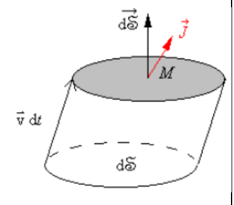
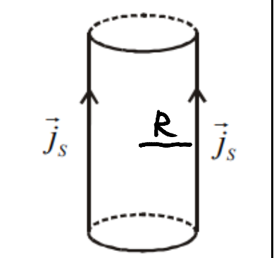
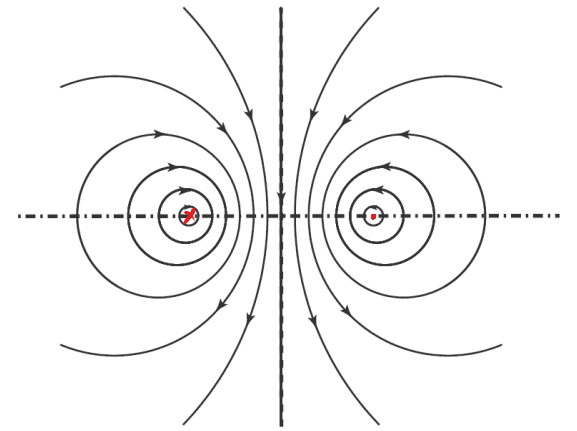
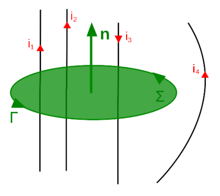
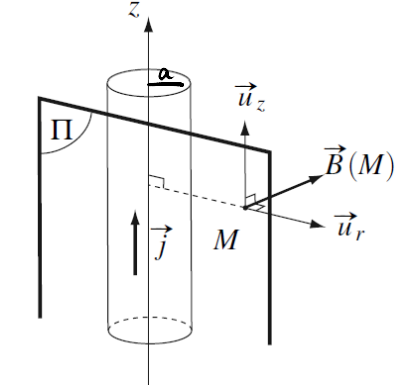
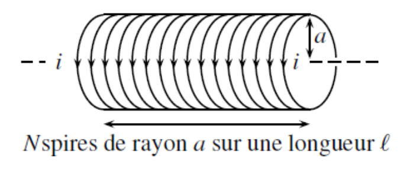
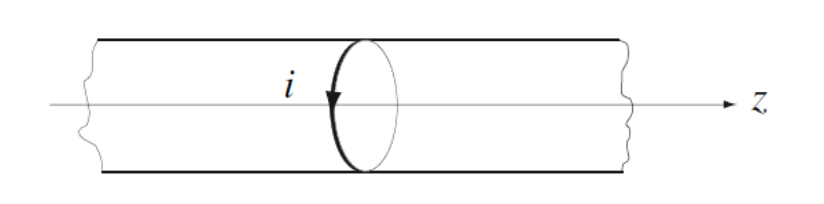
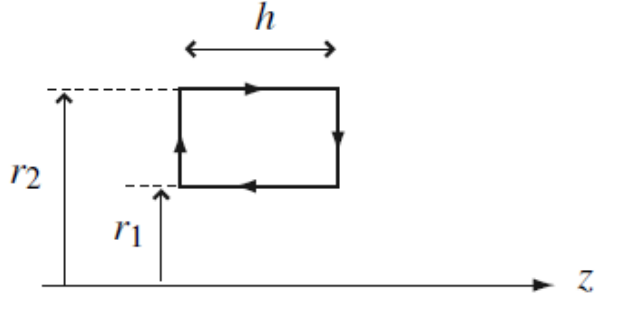
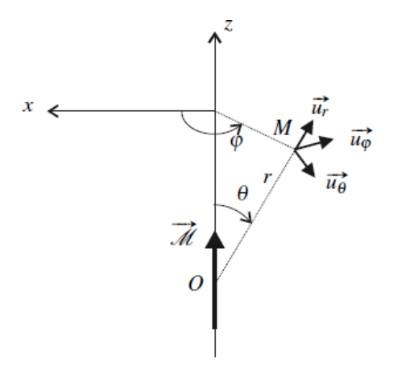
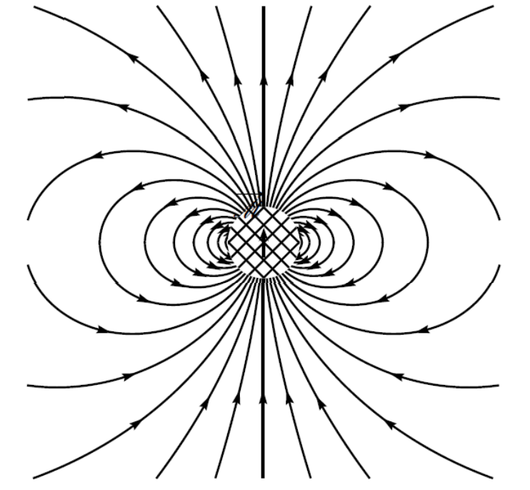

# Magnétostatique

> 关于磁的小知识XD                 

磁铁自古以来就为人所知, 被称为磁铁矿, 这种石头在土耳其的马格尼西亚城附近被发现, 现代 "磁场" 一词正是源自这种石头, 然而, 直到19世纪末, 才出现了完整的理论                    
在本章中, 我们研究的是由永久性源产生的磁场        

## 1.Le champ magnétostatique (磁场)        

### 1.1 Densité de courant (电流密度) 

在前一章中, 我们知道了电场是由于电荷的存在而产生的, 因为电荷会有相互作用                        
而当电荷以速度 $\vec{v}$ 运动时, 则会产生磁场           
在磁静力学的框架下, \(\vec{v} = \text{cste}\)   

我们可能会简单地认为用电流强度就足以描述电荷的运动, 这在所有载流子沿同一方向运动 (如在一根直导线上) 时是正确的              
但一般来说, 我们需要使用一个向量来量化电荷的运动                                                      

因此, 我们引入电流密度 \(\vec{j}(M)\) 的概念, 定义如下:    

\[
    \delta Q = \vec{j}(M) \cdot d\vec{S} \, dt
\]

其中, \(\delta Q\) 是在时间 \(dt\) 内通过微小表面元 \(d\vec{S}\) 的电荷量   

电流 \(i\) 通过表面 \(d\vec{S}\) 并沿 \(\vec{j}\) 方向的表达式为:   

\[
    i = \frac{\delta Q}{dt} = \vec{j}(M) \cdot d\vec{S}
\]

因此, 流过某一表面的电流强度等于该表面上的电流密度的通量   

\[
    I = \iint_S \vec{j}(M) \cdot d\vec{S}
\]

电流密度的单位为: $[\|\vec{j}\|] = A \cdot m^{-2}$                                

电流密度向量用于描述空间中电荷的运动情况, 而运动的电荷会产生磁场                                         
电流密度的概念可以类别上章所学的电场中的电荷体密度 \(\rho\)                     

---

我们尝试将电流密度 $\vec{j}$ 与载流子的运动联系起来                           
假设有携带电荷 \(q\) 的粒子, 它们以速度 \(\vec{v}\) 运动        
在时间 \(dt\) 内, 通过表面元 \(d\vec{S}\) 的电荷量为:   

\[
    \delta Q = n (\vec{v} dt \cdot d\vec{S}) q = (q n \vec{v}) \cdot d\vec{S} dt
\]

其中, \(n\) 是单位体积内的载流子数密度   
而 $\vec{j} = n q \vec{v}$                          

若存在多个种类的载流子, 每种载流子的电荷为 \(q_i\), 速度为 \(\vec{v}_i\), 数密度为 \(n_i\), 则总电流密度为:   

\[
    \vec{j} = \sum_i n_i q_i \vec{v}_i
\]

这说明不同载流子产生的电流密度是累加的   

---

我们尝试确定通过一根电线的电流密度的数量级                        
假设一根半径 \(r = 1mm\) 的导线, 电流 \(I = 1A\), 并且电流密度在整个导线上均匀分布
有: 

\[
    j = \frac{I}{\pi r^2} = \frac{1}{\pi \times (1 \times 10^{-3})^2} = 10^5 A \cdot m^{-2}  
\]

类似于静电学中的面电荷密度, 当电荷在非常薄的层内移动时, 可以引入面电流密度 \(\vec{j}_s\) 的概念   

例如, 对于一个导体截面 \(\Gamma\), 设 \(\sigma\) 为表面 \(\Sigma\) 上的面电荷密度, \(\vec{n}\) 为与 \(\Gamma\) 法向的单位向量, 且 \(d\vec{l} = d\ell \vec{n}\), 那么在时间 \(dt\) 内通过 \(d\ell\) 的电荷量为:   

\[
    \delta^2 Q = \sigma \vec{v} dt \cdot d\ell \vec{n}
\]

引入面电流密度 \(\vec{j}_s\):   

\[
    \delta^2 Q = \vec{j}_s \cdot d\ell \vec{n} dt
\]

整个 \(\Gamma\) 截面上的总电荷通过量为:   

\[
    \delta Q = \int_{\Gamma} \vec{j}_s \cdot d\ell \vec{n} dt
\]

因此, 流过 \(\Gamma\) 的电流强度 \(I\) 为:   

\[
    I = \frac{\delta Q}{dt} = \int_{\Gamma} \vec{j}_s \cdot d\ell \vec{n}
\]

!!! example "Exemple"
    对于半径 \(R\) 的圆柱体, 若表面流过均匀的面电流密度 \(\vec{j}_s\), 则其总电流强度为:   

    \[
        I = j_s \cdot 2 \pi R
    \]

    

### 1.2 Lignes de champ magnétostatique (磁场线) 

与电场一样, 磁场线是使得磁场在其上每一点都与该曲线相切的曲线 \(C\)   
磁场线具有如下性质:                     

* 磁场线是闭合的, 并包围磁场的源, 即电荷运动的区域   
* 沿磁场线方向, 磁场的强度变化规律如下:   

\[
    \begin{cases}
    当相邻磁场线彼此远离时, 磁场强度减小 \\
    当相邻磁场线彼此靠近时, 磁场强度增大 
    \end{cases}
\]

* 磁场线的方向遵循右手定则, 右手握住导线, 拇指指向电流正方向, 则弯曲的四指指向磁场线的方向   

!!! note "Note"
    注意:  磁场是是通量守恒的, 这意味着对于任意封闭曲面 \(S\), 有:

    \[
        \unicode{x222F}_S \vec{B} \cdot d\vec{S} = 0
    \]

    这一数学表达式也同时解释了磁场线的第二条性质, 即磁场线始终闭合   

!!! example "Exemple" 
    考虑两根通有相反方向电流的导线, 左侧导线的电流流入纸面, 右侧导线的电流流出纸面     

    

    磁场线围绕电流流过的导线闭合, 表明导线是磁场的源      

??? note "Extra-note" 

    * 若电流分布是无限延伸的, 某些磁场线可能看似开放, 但它们实际上在无穷远处闭合   
    * 电场线源自或汇聚于点电荷, 而磁场线则是围绕电流闭合的   
    * 在静电学中, 电场线的方向可用于判断电荷的正负；在磁静力学中, 磁场线的方向可用于判断电流的方向   

## 2.Théorème d’Ampère (安培环路定理)            

### 2.1 Symétries et invariances   

设 \(\Pi\) 为电流分布的 **对称平面** , 对于 \(\Pi\) 关于点 \(M\) 的对称点 \(M'\): 

- 电流密度 \(\vec{j}\) 满足: $\vec{j}(M') = \text{sym} (\vec{j}(M))$                               
- 磁场 \(\vec{B}\) 满足: $\vec{B}(M') = -\text{sym} (\vec{B}(M))$                                
- 若 \(M\) 属于对称平面 \(\Pi\), 则 \(\vec{B}(M)\) 垂直于 \(\Pi\)                

设 \(\Pi\) 为电流分布的 **反对称平面** , 对于 \(\Pi\) 关于点 \(M\) 的对称点 \(M'\):           

- 电流密度 \(\vec{j}\) 满足: $\vec{j}(M') = -\text{sym} (\vec{j}(M))$                                     
- 磁场 \(\vec{B}\) 满足: $\vec{B}(M') = \text{sym} (\vec{B}(M))$                        
- 若 \(M\) 属于反对称平面 \(\Pi\), 则 \(\vec{B}(M)\) 位于 \(\Pi\) 平面内   

磁场 \(\vec{B}\) 被称为赝矢量 (伪矢量, pseudo-vecteur)                          
电场 \(\vec{E}\) 和电流密度 \(\vec{j}\) 是极矢量 (vecteurs polaires)   

要确定 \(\vec{B}\) 的方向, 至少需要: 一个对称平面, 或两个反对称平面   
要确定 \(\vec{E}\) 的方向, 至少需要: 一个反对称平面, 或两个对称平面   

平移不变性: 若电流分布沿某一方向 \(\vec{u}_x\) 不变, 则磁场 \(\vec{B}\) 不依赖于 \(x\)   
旋转不变性: 若电流分布绕某轴 \(\vec{u}_z\) 旋转角度 \(\theta\) 后不变, 则磁场 \(\vec{B}\) 不依赖于 \(\theta\) 

### 2.2 Théorème d’Ampère      

设 \(\Gamma\) 为一个闭合且有方向的回路, 则有:   

\[
    C_B = \oint_{P \in \Gamma} \vec{B}(P) \cdot \vec{dl} = \mu_0 I_{\text{enlacé}}
\]

其中: \( I_{\text{enlacé}} \) 表示被回路 \(\Gamma\) 所包围的总电流, 其表达式为:   

\[
    I_{\text{enlacé}} = \iint_{M \in \Sigma} \vec{j}(M) \cdot \vec{dS}
\]

\(\Sigma\) 是任意一个以 \(\Gamma\) 为边界的曲面   
微元面积元 \( d\vec{S} \) 的方向取决于回路 \(\Gamma\) 所选定的方向 (遵循右手法则)    

!!! example "Exemple" 
    
    

    \[
        I_{\text{enlacé}} = I_1 + I_2 - I_3
    \] 

| **定理** | **高斯定理** | **安培环路定理** |
|------------|------------|------------|
| **作用对象** | 闭合曲面 $S$ | 闭合回路 $\Gamma$ |
| **分析对象和基本单位** | 电荷分布和电荷密度 $\rho$ | 电流分布和电流密度 $\vec{j}$ |
| **公式** | $\Phi = \unicode{x222F} \vec{E}(M) \cdot d\vec{S}(M) = \frac{Q_{\text{int}}}{\varepsilon_0}$ | $C_B = \oint_{P \in \Gamma} \vec{B}(P) \cdot \vec{dl} = \mu_0 I_{\text{enlacé}}$ |

接下来, 我们将研究几个重要的模型 

### 2.3 Fil rectiligne infini (无限长直导线)       

在此研究一根半径为 \( a \) 的导线, 其中电流密度 \( \vec{j} \) 在导线内部 (\( r < a \)) 是均匀的, 在导线外部为零              
由于 \( \vec{j} \) 在导线内均匀分布, 我们可以设其方向沿 \( z \) 轴, 即: $\vec{j} = j \vec{e}_z$                       
在导线截面上, 总电流为: $I = j \pi a^2$                       
我们选择圆柱坐标系, 点 \( M \) 的坐标表示为: $M(r, \theta, z)$

对称性: $(M,\vec{u_r},\vec{u_z})$ 对于电流分布是对称平面, 故: $\vec{B}(M) = B(M) \vec{u_\theta}$                     

不变性: 对于轴 $\vec{u_z}$ 和绕轴 $\vec{u_z}$ 的角 $\theta$ , 有平移和旋转不变性, 故: $\vec{B}(M) = B(r) \vec{u_\theta}$

我们选择如下图所示的闭合回路 $\Gamma$ , 且分成两种情况讨论:      

\[
    C_{\vec{B}} = \int_{P \in \Gamma} \vec{B}(P) \vec{dl}(P) = \int_0^{2 \pi} B(r) \vec{u_\theta} r d\theta \vec{u_\theta} = B(r) r 2 \pi
\]

* $r < a$ ($M$ 在导线内部) :             

\[
    I_{\text{enlacé}} = j \pi r^2
\]

\[
    B(r) = \frac{\mu_0 j r}{2} = \frac{\mu_0 I r}{2 a^2}
\]

* $r > a$ ($M$ 在导线外部) :             

\[
    I_{\text{enlacé}} = j \pi a^2
\]

\[
    B(r) = \frac{\mu_0 j a^2}{2r} = \frac{\mu_0 I}{2 \pi r}
\]

我们得到:         

\[
    \begin{cases}
    \vec{B}(M) = \frac{\mu_0 I r}{2 a^2} \vec{u_\theta}, \quad r < a \\
    \vec{B}(M) = \frac{\mu_0 I}{2 \pi r} \vec{u_\theta}, \quad r > a 
    \end{cases}
\]

!!! note "Note"
    备注: 第二个表达式 $(r>a)$ 与 \( a \) 无关, 我们可以得出由一根无限细的导线 (当 \( a \to 0 \) 时) 所产生的磁场, 该导线中流经电流 \( I \):   

    \[
        \vec{B} = \frac{\mu_0 I}{2\pi r} \vec{u}_{\theta}
    \]

### 2.4 Solénoïde infini (无限长螺线管)     

我们选择圆柱坐标系, 点 \( M \) 的坐标表示为: $M(r, \theta, z)$

对称性: $(M,\vec{u_r},\vec{u_\theta})$ 对于电流分布是对称平面, 故: $\vec{B}(M) = B(M) \vec{u_z}$                     

不变性: 对于轴 $\vec{u_z}$ 和绕轴 $\vec{u_z}$ 的角 $\theta$ , 有平移和旋转不变性, 故: $\vec{B}(M) = B(r) \vec{u_z}$

我们在 \( \theta = cste \) 平面内选取一个闭合回路, 如下图所示, 沿矩形回路计算磁场环量, 并分两种情况讨论:              

\[
    C_B = \int_{P \in \Gamma} \vec{B}(P) \cdot \vec{dl}(P) = \int_{P \in [A,B]} \vec{B}(P) \cdot \vec{dl}(P) + \int_{P \in [B,C]} \vec{B}(P) \cdot \vec{dl}(P) + \int_{P \in [C,D]} \vec{B}(P) \cdot \vec{dl}(P) + \int_{P \in [D,A]} \vec{B}(P) \cdot \vec{dl}(P) 
\]

分别计算:                   

\[
    \int_{P \in [A,B]} \vec{B}(P) \cdot \vec{dl}(P) = \int_{z_B}^{z_A} B(r_1) \vec{u_z} \cdot (-dz) \vec{u_z} = - B(r_1)(z_A - z_B) = - B(r_1)h              
\]

\[
    \int_{P \in [B,C]} \vec{B}(P) \cdot \vec{dl}(P) = \int B(r) \vec{u_z} \cdot dr \vec{u_r} = 0                         
\]

\[
    \int_{P \in [C,D]} \vec{B}(P) \cdot \vec{dl}(P) = \int_{z_C}^{z_D} B(r_2) \vec{u_z} \cdot dz \vec{u_z} = B(r_2)(z_D - z_C) = B(r_2)h              
\]

\[
    \int_{P \in [D,A]} \vec{B}(P) \cdot \vec{dl}(P) = \int B(r) \vec{u_z} \cdot dr \vec{u_r} = 0                         
\]

代入:   

\[
    C_B = h (B(r_2) - B(r_1))
\]

* $r_1 > a$ (所选回路在导线外部) :             

\[
    I_{\text{enlacé}} = 0
\]

\[
    B(r_1) = B(r_2) = 0
\]

故对于一根无限长的螺线管, 其外部的静磁场均为零               

* $r_1 < a < r_2$ (所选回路被螺线管表面穿过) :             

\[
    I_{\text{enlacé}} = - i \frac{N}{\ell} \cdot h
\]

> 需要注意此处电流方向是对所选回路使用右手定确定的, 而螺线管穿过的电流方向相反, 故有负号

由前一种情况我们知道螺线管外部磁场为零, 故有 $B(r_2) = 0$, 代入安培环路定理: 

\[
    h(0 - B(r_1)) = \mu_0 I_{\text{enlacé}} = -\mu_0 i \frac{N}{\ell} \cdot h
\]

螺线管内部磁场:                

\[
    B_{\text{int}} = \frac{\mu_0 N i}{\ell} = \mu_0 n i , \quad 设 n = \frac{N}{\ell} 为螺线管每单位长度的匝数
\]

??? note "Extra-note: Loi de Biot et Savart (毕奥-萨伐尔定律)"
    毕奥-萨伐尔定律描述了电流元在空间某一点产生的磁场, 其数学表达式为:     

    \[
        d\vec{B} = \frac{\mu_0}{4\pi} \frac{i \, d\vec{l} \wedge \vec{r}}{r^3}
    \]

    其中: 

    - \( d\vec{B} \) 是由电流元 \( i \, d\vec{l} \) 在空间一点产生的微小磁场             
    - \( d\vec{l} \) 是电流元的长度方向向量             
    - \( \vec{r} \) 是从电流元指向场点的位矢                
    - \( r \) 是该位矢的模                  

    毕奥-萨伐尔定律表明电流产生的磁场类似于库仑定律中点电荷产生的电场, 但磁场方向由右手定则确定                
    它适用于计算直导线, 环形电流, 螺线管等系统的磁场分布

## 3.Dipôle magnétique                         

### 3.1 Moment magnétique (磁矩)            

对于一个细导线回路, 当有电流 \( I \) 通过, 并围住一个法向单位向量为 \( \vec{n} \), 面积为 \( S \) 的表面时, 其磁矩定义为: 

\[
    \vec{\mathcal{M}} = I S \vec{n}
\]

磁矩的单位为安培·平方米 $(A·m²)$ 

\( \vec{n} \) 的方向由右手法则确定                                 

对于一个由多匝线圈组成的螺线管, 其总磁矩等于每个线圈磁矩的总和

!!! example "Exemple"
    - 原子的磁矩 (玻尔磁子) : $\mu_B = \frac{e \hbar}{2m} \approx 10^{-23} \text{ A·m²}$
    - 指南针的磁矩: $\mathcal{M} \approx 1 \text{ A·m²}$

### 3.2 Champ crée par un dipôle magnétique (磁偶极子产生的磁场)     

磁偶极子的近似: 电流 \( I \) 通过的回路的 "特征尺寸" (La taille caractéristique) \( a = \sqrt{S} \) 相对于回路与观察点之间的距离 \( r \) 非常小, 即 \( a \ll r \), 在这种近似下, 回路被称为磁偶极子, 并且只通过其磁矩来表示

与静电偶极子类似, 可以在磁偶极子的近似下确定磁偶极子所产生的磁场, 表达式如下: 

\[
    \vec{B}(M) = \frac{\mu_0}{4\pi} \frac{3(\vec{\mathcal{M}} \cdot \vec{OM}) \vec{OM} - OM^2 \vec{\mathcal{M}}}{OM^5}
\]

该表达式与电偶极子的电场表达式类似, 仅需进行如下替换:                

- 将 \( \frac{1}{4\pi\epsilon_0} \) 替换为 \( \frac{\mu_0}{4\pi} \)                 
- 将 电偶极矩 \( \vec{p} \) 替换为 磁矩 \( \vec{\mathcal{M}} \)

---

我们可以画出由位于图中心的磁偶极子所产生的磁场线的形态，磁偶极子通过其垂直向上的磁矩表示                     

需要注意的是在中心阴影区域, 磁场 \( \vec{B} \) 的值未知, 因为磁偶极子近似在该区域不适用                           
并且磁场线的方向与磁矩一致                              

### 3.3 Actions subies par un dipôle magnétique                                

考虑一个磁偶极矩 \(\vec{M}\) 处于一个均匀磁场 \(\vec{B}\) 中                                 
> 磁偶极矩所产生的磁场不影响该偶极子, \(\vec{B}\) 是在没有偶极子的情况下存在的磁场, 且我们不详细探讨其来源       

该磁偶极子受力矩 \(\vec{\Gamma} = \vec{M} \wedge \vec{B}\) 的作用       
它具有与磁场 \(\vec{B}\) 相互作用的势能:       

\[
    E_p = - \vec{M} \cdot \vec{B} 
\]  

就像电偶极子在电场中的势能一样, 当磁偶极矩与磁场 \(\vec{B}\) 同向 (平行排列) 时, 势能最小, 此时平衡是稳定的            
而当磁偶极矩与磁场 \(\vec{B}\) 相反 (反平行排列) 时, 尽管它们是对齐的, 但方向相反, 此时平衡是不稳定的        